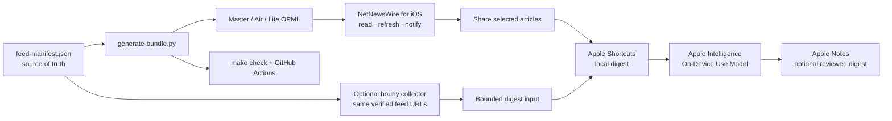
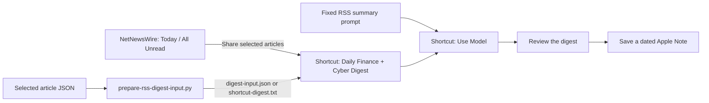

# NetNewsWire Finance + Cyber RSS

[](https://github.com/ZeroXSHDW/NetNewsWire_iOS_RSS/actions/workflows/rss-validation.yml)

A manifest-driven, privacy-conscious RSS workflow for **NetNewsWire on iPhone**. It combines Ireland, EU, UK and US finance sources with official cybersecurity alerts, incident reporting and technical research—and adds a local-first Apple Intelligence digest layer for articles you deliberately provide.

> **The short version:** NetNewsWire collects and organizes the feeds. The manifest defines what belongs in each profile. Apple Intelligence summarizes only the selected, prepared article text; it does not fetch news, trade, or make decisions for you.
>
> This repository is **not a standalone iOS app**. It is a ready-to-import OPML/feed bundle plus optional Shortcuts and Apple Intelligence instructions.

## At a glance

| Profile | Feeds | Best for | Download |
| --- | ---: | --- | --- |
| **iPhone Air** | 125 | Recommended daily profile with broad coverage and a 4 MB full-body budget | [Download for iPhone](artifacts/opml/NetNewsWire-Finance-Cyber-iPhone-Air.opml?raw=1) · [inspect OPML](artifacts/opml/NetNewsWire-Finance-Cyber-iPhone-Air.opml) · [source table](artifacts/sources/NetNewsWire-Finance-Cyber-iPhone-Air-Source-Table.md) |
| **iPhone Lite** | 118 | Lower-noise mobile reading and smaller refreshes | [Download for iPhone](artifacts/opml/NetNewsWire-Finance-Cyber-iPhone-Lite.opml?raw=1) · [inspect OPML](artifacts/opml/NetNewsWire-Finance-Cyber-iPhone-Lite.opml) · [source table](artifacts/sources/NetNewsWire-Finance-Cyber-iPhone-Lite-Source-Table.md) |
| **Master** | 536 | Full research coverage and rebuilding the other profiles | [Download for iPhone](artifacts/opml/NetNewsWire-Finance-Cyber.opml?raw=1) · [inspect OPML](artifacts/opml/NetNewsWire-Finance-Cyber.opml) · [source table](artifacts/sources/NetNewsWire-Finance-Cyber-Source-Table.md) |

The repository contains **428 finance feeds** and **108 cybersecurity feeds**. Four official alert feeds are configured for interrupting notifications; the remaining sources are intended for normal reading, optional notifications or digest review.

## What you need

| App or tool | Needed? | What it does |
| --- | --- | --- |
| **NetNewsWire for iOS** | Required | Imports the OPML bundle, refreshes feeds, organizes folders, sends selected notifications and shares articles. |
| **Apple Shortcuts** | Optional | Receives selected articles from NetNewsWire and passes them to the digest workflow. |
| **Apple Intelligence** | Recommended for the local digest path | Runs the Shortcuts **Use Model** step on supplied article text; set it to **On-Device** for short/private batches. It is not required for reading RSS. |
| **Apple Notes** | Optional | Stores a dated copy of the reviewed digest. |
| **Mac + Python 3.11/3.12, `make` and zsh** | Maintainer only | Regenerates bundles, prepares digest input and runs offline checks. |
| **`curl` + `xmllint` (libxml2)** | Live validation only | Fetches direct feed endpoints and verifies their XML. |

You can use the project with **NetNewsWire alone**. Add Shortcuts, Apple Intelligence and Notes only if you want the optional digest workflow.

## Install directly from this GitHub page

If you are reading this README on your iPhone, you do not need a Mac or AirDrop:

1. Install [NetNewsWire for iPhone and iPad](https://netnewswire.com/) if it is not already installed.
2. Tap [Download the recommended iPhone Air profile](artifacts/opml/NetNewsWire-Finance-Cyber-iPhone-Air.opml?raw=1). Use [iPhone Lite](artifacts/opml/NetNewsWire-Finance-Cyber-iPhone-Lite.opml?raw=1) for a smaller bundle, or [Master](artifacts/opml/NetNewsWire-Finance-Cyber.opml?raw=1) for all feeds.
3. If Safari shows the OPML text, tap **Share → Save to Files**. If it downloads automatically, find it in **Files → Downloads**. Keep the `.opml` extension.
4. In NetNewsWire, open **Feeds → Settings → Import Subscriptions**, choose the downloaded file, and select the account that should receive the feeds.
5. Refresh once and confirm the **Finance** and **Cyber Security** folders. Import only one profile: OPML imports are additive and can duplicate an older copy.

For the official explanation of this import flow, see [NetNewsWire’s OPML instructions](https://netnewswire.com/help/ios/6.1/en/import-opml.html).

## Choose your path

| If you want to… | Use this |
| --- | --- |
| Read the recommended daily mix | NetNewsWire + **iPhone Air** OPML |
| Reduce refresh cost while travelling | NetNewsWire + **iPhone Lite** OPML |
| Search or research every configured source | NetNewsWire + **Master** OPML |
| Create a reviewed daily digest | NetNewsWire + Shortcuts + on-device Apple Intelligence |
| Prepare unattended hourly-or-faster batches | [`NetNewsWire-Hourly-Apple-Intelligence-Workflow.md`](docs/NetNewsWire-Hourly-Apple-Intelligence-Workflow.md) + macOS launchd + Shortcuts |
| Maintain or publish the project | Mac toolchain + `feed-manifest.json` + GitHub Actions |

## What this project does

- Keeps the feed inventory, folders, profile membership and notification policy in [`feed-manifest.json`](feed-manifest.json).
- Generates importable OPML files and human-readable source tables from that manifest.
- Provides iPhone Air and iPhone Lite bundles so the phone gets useful signal without importing every research feed.
- Prepares selected RSS articles for a repeatable Apple Intelligence workflow with deduplication, sanitization, time handling and size limits.
- Provides an optional manifest-mirror collector and macOS launchd handoff for bounded hourly-or-faster Apple Intelligence batches.
- Validates feed URLs, metadata, profile budgets and generated artifacts in CI.

The generated files are delivery artifacts. Edit the manifest first, then run `make generate` or `make package` to rebuild them.



## What the result looks like

These repository-authored previews make the deliverable visible before you import anything. They use the current iPhone Air folders, alert policy and Apple Intelligence handoff described by the manifest; they are interface illustrations, not screenshots or NetNewsWire source code.


*NetNewsWire result: organized Finance and Cyber Security folders, four interrupting alert feeds, and quieter sources available for reading or digest review.*


*Apple Intelligence result: selected evidence passes through Shortcuts, then becomes a reviewed digest with provenance, uncertainty labels and no action recommendation.*

## Feed coverage

### Finance — 428 feeds

| Group | Count | Coverage |
| --- | ---: | --- |
| Market & Trading | 10 | Euronext market-status and Athens market-notice alerts, Nasdaq trade halts and trader alerts, business headlines and market reporting |
| Official & Macro | 133 | Central banks, regulators, financial-intelligence, monetary policy, banking supervision, enforcement and market operations, including Banco Central do Brasil news on Pix, payments, virtual-asset regulation, foreign exchange, Open Finance and financial-system supervision, Banca d’Italia English central-bank news, Norges Bank press releases, European Investment Fund SME and development-finance activity, ESRB Press, Publications & Research, Policy Warnings & Advice and National Macroprudential Notifications, AFM Dutch conduct supervision, EIOPA insurance and occupational-pensions supervision, UK Ofgem and Ofcom energy/communications regulation, UK Export Finance trade-credit activity and UK DWP pensions, labour and benefits activity, U.S. Treasury press releases and SEC speeches/statements and testimony, CFTC press, enforcement and speeches/testimony, OCC news releases, bulletins, speeches, congressional testimony and publications, National Futures Association rulebook, notices, board, consultation, CFTC rule-submission, news-release and regulatory-action streams, BaFin’s German supervisory-measures and circular streams, Swedish Finansinspektionen, the European Ombudsman’s institutional-accountability and transparency decisions, EUR-Lex adopted legislation and Official Journal notices, CFPB and FTC consumer-protection, DNB’s general and supervision news, OSFI’s Canadian prudential-supervision stream, the independent UK Office for Budget Responsibility, Japan, Switzerland, Norway, Spain, Sweden, Czechia, Denmark, Korea and the Philippines, alongside EPPO, FINTRAC, OLAF, Eurojust, Frontex border and organised-crime operations, the European Commission’s competition, energy, transport, tax/customs, trade and economic-security, financial-services, and Migration & Home Affairs news, official UK Home Office, Ministry of Defence and Department for Transport activity, U.S. Department of Defense newsroom and releases, U.S. Department of Energy energy-security, critical-minerals, grid and nuclear news, U.S. Nuclear Regulatory Commission news releases, FEMA emergency-response news, U.S. Energy Information Administration energy-market analysis and forecast releases, Australia’s Treasury and APRA, HMRC, SFO, the Insolvency Service, UK CMA, DOJ Antitrust and National Security Division, Federal Reserve other announcements, France’s AMF, OCC, FDIC, Bank of Canada, HKMA consultations, supervisory-policy updates and circulars, RBI, SEBI, Japan FSA, Swiss National Bank monetary-policy decisions, Finanstilsynet, CSSF, Austria’s FMA and Belgium’s FSMA, plus Canadian National Defence, Global Affairs Canada, Defence Investment Agency and Canadian Security Intelligence Service news |
| Data, Ireland, EU & UK | 46 | Reference rates, central-bank and national statistical releases, Eurostat industry/trade/services releases, sanctions guidance, release calendars, ComReg communications regulation, Houses of the Oireachtas press releases and sitting/committee schedules, Banco Central do Brasil market-data/statistical feeds, plus Bank of Korea, National Bank of Poland, Statistics Canada, US Census and BEA statistics coverage |
| Global Data & Research | 218 | Central-bank speeches, minutes, reports, working papers, statistics and analysis from Switzerland, Norway, Spain, Sweden, Czechia, Denmark, Korea, Germany and Australia, plus ASEAN diplomatic and regional-policy news, ASEAN+3 macroeconomic surveillance and AMRO research/press releases, European Commission agriculture and rural-development, enlargement/Eastern Neighbourhood and Oceans & Fisheries news, European Maritime Safety Agency maritime-resilience updates, European Union Agency for Railways rail-safety, interoperability, resilience and transport-policy news, Eurostat catalogue data-structure updates, European Training Foundation labour-migration, skills, employability and human-capital reform news, European Commission harmonised-standards notices, Apple Newsroom company, Apple Intelligence, iOS, privacy, EU platform-policy and ecosystem news, Asian and African development-bank news/releases, UK and EU institutional activity, public-health and climate coverage, ECHR and UN case-law/meeting streams, central-bank research, statistics and publications, space and aviation safety, EU Agency for the Space Programme news and press releases, official Council of the EU meeting calendars, UK Parliament public and private bill activity, UK Parliament POST science-policy research, UK national-security and economic-security activity, European Commission Representation in Ireland news, European Union Agency for Fundamental Rights publications, Japanese securities-surveillance and market-conduct releases, and the new Federal Register OFAC sanctions, FinCEN financial-crime and OCC banking-rule notices alongside the retained development, economic, legal, health, science and research sources |
| UK Regulation & Warnings | 21 | Bank of England prudential publications, FCA news, scam warnings, OFSI financial sanctions and direct GOV.UK activity, Ofgem energy-market regulation, Ofcom communications and online-safety regulation, Guernsey financial-crime and sanctions notices, National Crime Agency GOV.UK and direct operational economic-crime and cyber-enforcement news, Public Sector Fraud Authority fraud-prevention policy, Ministry of Justice justice-policy activity, Attorney General's Office, Crown Prosecution Service, HM Courts & Tribunals Service and Courts and Tribunals Judiciary legal activity, Financial Reporting Council audit and corporate-governance regulation, The Pensions Regulator workplace-pensions supervision, Payment Systems Regulator payments oversight, Pension Protection Fund compensation and resilience activity, OTSI trade sanctions and ECJU export-control updates |

### Cyber Security — 108 feeds

| Group | Count | Coverage |
| --- | ---: | --- |
| Ireland, EU & official alerts | 33 | Ireland NCSC alerts and guidance, CISA, CERT-EU, CERT-FR, NCSC UK, CISA News, CIS MS-ISAC vulnerability advisories, Swiss NCSC/BACS, ACN / CSIRT Italia, EDPB, New Zealand and other national cyber authorities, plus Belgian CCB, Romanian DNSC, CERT.LV, SI-CERT, Norway NCSC, INCIBE, Czech NÚKIB, Croatian CERT.hr, Estonian RIA, JPCERT/CC, JVN, Communications Security Establishment national-cyber and signals-intelligence news, and the Canadian Centre for Cyber Security alerts and advisories stream |
| News & incident reporting | 7 | BleepingComputer, The Hacker News, CyberScoop, SecurityWeek, The Record, The DFIR Report and Krebs on Security; The Hacker News is Master-only after the latest phone rebalance |
| Technical research | 14 | CERT/CC, NIST, Google Security Blog, Rapid7 Research, Elastic Security Labs, FBI Cyber Division, Mandiant, Project Zero, Microsoft, Unit 42, GitHub Security, OWASP, ZDI and Trail of Bits |
| Specialist alerts & research | 54 | Council of the EU Justice & Home Affairs meeting calendar, Atlantic Council, FDD, Lawfare Cybersecurity & Tech, NIST general news and critical-technology research, ECFR, Bellingcat, Global Initiative, Jamestown, RUSI, SIPRI, Chatham House and EUISS strategic-security, OSINT, organized-crime and geopolitical research, official European Commission digital-strategy news, European Cybersecurity Competence Centre and Network EU cyber-resilience and funding news, eu-LISA updates and publications on EU large-scale IT systems and digital resilience, UK DSIT digital/AI/telecoms-security and cyber-resilience activity, UK Government cyber-security news, research/statistics and policy-paper streams, KISA, KrCERT/CC, ICS, HKCERT, Belgian CCB news, INCIBE consumer warnings, EASA aviation-cybersecurity and GNSS-resilience news, German BSI/CERT-Bund advisories, ANSSI threat overviews, CSSF financial-cybersecurity publications, NCSC-FI vulnerability notices, vendor advisories, cloud/container security, supply-chain, threat-intelligence and research, plus the Canadian Centre for Cyber Security guidance, news and events stream |

### Profile coverage matrix

Master includes every feed. Air and Lite are curated subsets of the same manifest:

| Feed group | Master | iPhone Air | iPhone Lite |
| --- | ---: | ---: | ---: |
| Finance — Market & Trading | 10 | 4 | 3 |
| Finance — Official & Macro | 133 | 57 | 56 |
| Finance — Data, Ireland, EU & UK | 46 | 8 | 6 |
| Finance — Global Data & Research | 218 | 30 | 29 |
| Finance — UK Regulation & Warnings | 21 | 2 | 2 |
| Cyber — Ireland, EU & Official Alerts | 33 | 13 | 12 |
| Cyber — News & Incident Reporting | 7 | 3 | 3 |
| Cyber — Technical Research | 14 | 4 | 4 |
| Cyber — Specialist Alerts & Research | 54 | 4 | 3 |
| **Total** | **536** | **125** | **118** |

<details>
<summary>Show all 536 feed names</summary>

#### Finance

**Market & Trading**

- Nasdaq Trader — Trade Halts
- Nasdaq Trader — Equity Trader Alerts
- Euronext — Market Status
- Euronext Athens — Market Notices
- BBC — Business
- Bloomberg — Markets
- Financial Times — Markets
- MarketWatch — Top Stories
- RTÉ — Business
- The Wall Street Journal — Markets

**Official & Macro**

- Central Bank of Ireland — News
- European Central Bank — Press
- European Banking Authority — News
- European Systemic Risk Board — Press
- European Systemic Risk Board — Publications & Research
- European Systemic Risk Board — Policy Warnings & Advice
- European Systemic Risk Board — National Macroprudential Notifications
- European Securities and Markets Authority — News
- EIOPA — News
- AFM — Sector News (Dutch)
- Finansinspektionen — News (English)
- European Ombudsman — News & Decisions (English)
- EUR-Lex — Parliament & Council Legislation (English)
- EUR-Lex — Official Journal C (English)
- AMF — News
- ECB Banking Supervision — Press
- Financial Stability Board — News
- Single Resolution Board — News
- European Investment Fund — News
- AMLA — News & Press
- European Public Prosecutor’s Office — News
- European Anti-Fraud Office (OLAF) — News
- Eurojust — Press Releases & News
- European Commission — Competition Policy News
- European Commission — Taxation & Customs News
- European Commission — Financial Services News (FISMA)
- Banca d’Italia — News (English)
- European Commission — Energy News
- European Commission — Trade & Economic Security News
- European Commission — Mobility & Transport News
- European Commission — Migration & Home Affairs News
- Frontex — News Releases
- Bank of England — News
- HM Treasury — News & Communications
- UK Department for Work and Pensions — Activity on GOV.UK
- Ofgem — Activity on GOV.UK
- Ofcom — Activity on GOV.UK
- Office for Budget Responsibility — News
- UK Export Finance — Activity on GOV.UK
- HM Revenue & Customs — Activity on GOV.UK
- Serious Fraud Office — Activity on GOV.UK
- Insolvency Service — Activity on GOV.UK
- UK Home Office — Activity on GOV.UK
- UK Ministry of Defence — Activity on GOV.UK
- UK Department for Transport — Activity on GOV.UK
- U.S. Department of Defense — News
- U.S. Department of Defense — Releases
- U.S. Department of Energy — Energy News
- National Defence — News
- Global Affairs Canada — News
- Defence Investment Agency — News
- Canadian Security Intelligence Service — News
- FEMA — News Releases
- U.S. Energy Information Administration — Today in Energy
- U.S. Energy Information Administration — Press Releases
- Federal Reserve — Monetary Policy
- Federal Reserve — Other Announcements
- Federal Reserve — Banking & Consumer Regulatory Policy
- Federal Reserve — Enforcement Actions
- Federal Reserve — Banking Applications
- Banco Central do Brasil — News (Portuguese)
- OCC — Bulletins
- OCC — News Releases
- OCC — Speeches
- OCC — Congressional Testimony
- OCC — Publications
- NFA — Manual Updates
- NFA — News Releases
- NFA — Notices to Members
- NFA — Board Updates
- NFA — Comment Letters
- NFA — CFTC Rule Submission Letters
- NFA — Regulatory Actions
- FDIC — Press Releases
- Bank of Canada — Press Releases
- OSFI — News
- DNB — General News
- DNB — Supervision News
- Bank of Canada — Market Notices
- Bank of Canada — Regulatory News
- FINTRAC — News
- HKMA — Circulars
- HKMA — Consultations
- HKMA — Supervisory Policy Manual
- Reserve Bank of India — Press Releases
- Reserve Bank of India — Notifications
- Japan Financial Services Agency — English News
- SEBI — Press Releases, Circulars & Orders
- Australian Treasury — Treasurer’s Media Releases
- Australian Treasury — Assistant Treasurer & Financial Services Releases
- APRA — News
- Bank of Japan — What's New
- Swiss National Bank — Press Releases
- Swiss National Bank — Monetary Policy
- Norges Bank — Press Releases
- Banco de España — News & Events
- Banco de España — Regulatory Circulars
- Riksbank — Press Releases
- Riksbank — News
- Czech National Bank — Press Releases
- Danmarks Nationalbank — Press Releases
- Danmarks Nationalbank — Speeches
- Danmarks Nationalbank — Market Announcements
- Bank of Korea — Press Releases
- Bank of Korea — Monetary Policy Decisions
- Bangko Sentral ng Pilipinas — Media Releases
- Bangko Sentral ng Pilipinas — Issuances
- Bangko Sentral ng Pilipinas — Public Advisories
- SEC — Press Releases
- U.S. Treasury — Press Releases
- SEC — Speeches and Statements
- SEC — Testimony
- CFTC — General Press Releases
- CFTC — Enforcement
- CFTC — Speeches and Testimony
- Federal Trade Commission — Consumer Protection Press Releases
- Federal Trade Commission — Competition Press Releases
- CFPB — Newsroom
- Competition and Markets Authority — Activity on GOV.UK
- DOJ Antitrust Division — Press Releases
- DOJ National Security Division — News
- ECB — Market Operations
- Federal Reserve — Speeches

**Data, Ireland, EU & UK**

- ECB — USD Reference Rate
- ECB — GBP Reference Rate
- ECB — Statistical Releases
- Central Bank of Ireland — Markets Update
- ComReg — News and Publications
- Houses of the Oireachtas — Press Releases
- Houses of the Oireachtas — Dáil Schedule
- Houses of the Oireachtas — Seanad Schedule
- Houses of the Oireachtas — Committee Schedule
- Eurostat — Economy & Finance Releases
- Eurostat — Industry, Trade & Services Releases
- European Commission — Sanctions Guidance
- UK ONS — Release Calendar
- Bank of Japan — Statistics
- Danmarks Nationalbank — Statistical News
- DNB — Statistical News
- Banco Central do Brasil — Exchange Rate
- Banco Central do Brasil — Focus Market Readout
- Banco Central do Brasil — Open Market Statistics
- Bank of Korea — Statistics & Publications
- Bank of Korea — Payment & Settlement Systems
- Banco de México — Exchange Rate FIX
- Banco de México — Exchange Rate for Payments
- Banco de México — Euro Exchange Rate
- Banco de México — Target Rate
- Banco de México — Interbank Funding
- Banco de México — TIIE 28 Days
- Banco de México — CETES 28 Days
- Banco de México — Worker Remittances
- Banco de México — International Reserves
- Banco de México — Investment Units (UDIS)
- Banco de México — Commercial Bank Term Deposit Cost (CCP)
- Banco de México — Commercial Bank Funding Cost (CPP)
- Banco de México — Dollar Term Deposit Cost (CCP-Dollars)
- Banco de México — UDIS Term Deposit Cost (CCP-UDIS)
- National Bank of Poland — Table A Average Exchange Rates
- National Bank of Poland — Table B Average Exchange Rates
- National Bank of Poland — Table C Buying and Selling Rates
- Statistics Canada — Economic Accounts
- Statistics Canada — Labour
- Statistics Canada — Prices and Price Indexes
- Statistics Canada — Housing
- Statistics Canada — Manufacturing
- Statistics Canada — Retail and Wholesale
- Statistics Canada — Business Performance and Ownership
- US Bureau of Economic Analysis — News Releases
- US Census Bureau — Economic Indicators

**Global Data & Research**

- African Development Bank — News & Events
- WHO Africa — Featured News
- UK Foreign, Commonwealth & Development Office — Activity on GOV.UK
- UK Cabinet Office — Activity on GOV.UK
- UK Department of Health and Social Care — Activity on GOV.UK
- United Nations — Meetings Coverage and Press Releases
- United Nations Office at Geneva — Meeting Summaries
- U.S. Courts — Judiciary News
- Caribbean Development Bank — News Releases
- Afreximbank Research — Journal of African Trade
- UK Department for Business and Trade — Activity on GOV.UK
- UK Department for Environment, Food & Rural Affairs — Activity on GOV.UK
- UK Government Office for Science — Activity on GOV.UK
- Pan American Health Organization — News
- Food and Agriculture Organization of the United Nations — Newsroom
- European Court of Human Rights — Press Releases (English)
- European Court of Human Rights — Grand Chamber Judgments (English)
- European Court of Human Rights — Chamber Judgments and Decisions (English)
- European Union Agency for Fundamental Rights — News
- European Union Agency for Fundamental Rights — Publications
- European Union Agency for Asylum — Press Releases
- European Labour Authority — News
- European Commission — Employment, Social Affairs & Inclusion News
- European Commission — Environment News
- European Commission — Public Health News
- European Commission — Climate Action News
- Banco de la República — News & Research (Spanish)
- Reserve Bank of Australia — Daily Exchange Rates
- Reserve Bank of Australia — Media Releases
- Reserve Bank of Australia — Speeches
- Reserve Bank of Australia — Bulletin
- Reserve Bank of Australia — Financial Stability Review
- Reserve Bank of Australia — Statements on Monetary Policy
- Reserve Bank of Australia — Research Discussion Papers
- BIS — Statistical Releases
- BIS — Press Releases
- European Central Bank — Blog
- European Central Bank — Publications
- European Central Bank — Working Papers
- European Central Bank — Research Bulletin
- Federal Trade Commission — HSR Early Termination Notices
- Bank of England — Publications
- ECB Banking Supervision — Publications
- ECB Banking Supervision — Speeches
- Federal Reserve — Working Papers
- Federal Reserve — FEDS Notes
- Federal Reserve — International Finance Discussion Papers
- Banco Central do Brasil — Direct Investment Report
- Banco Central do Brasil — Financial Stability Report
- Banco Central do Brasil — Inflation Report
- Banco Central do Brasil — Comef Minutes
- Banco Central do Brasil — Copom Minutes
- Banco Central do Brasil — Research Reports
- Bank of Korea — Monetary Policy Reports
- Bank of Korea — Monetary Policy Board Minutes
- Bank of Korea — Speeches
- Bank of Korea — Regional Economic Report
- Bank of Korea — Economic Analysis
- Bank of Korea — Financial Stability Report
- BIS — FSI Publications
- BIS — Central Bankers’ Speeches
- BIS — Management Speeches
- European Investment Bank — Press Releases
- European Investment Bank — News
- European Investment Bank — Publications
- European Investment Bank — Blog
- Apple — Newsroom
- Apple Developer — News
- European Commission — Harmonised Standards
- Asian Infrastructure Investment Bank — News
- Asian Infrastructure Investment Bank — Blogs
- Asian Development Bank — News Releases
- Asian Development Bank — Publications
- ASEAN — News
- ASEAN+3 Macroeconomic Research Office — News & Research
- ASEAN+3 Macroeconomic Research Office — Press Releases
- European Commission — Agriculture & Rural Development News
- European Commission — Enlargement & Eastern Neighbourhood News
- European Commission — Oceans & Fisheries News
- Eurostat — Data and Data Structure Updates
- European Training Foundation — News
- European Union Agency for Railways — News
- Eurofound — News
- European Economic and Social Committee — News
- European Maritime Safety Agency — Latest News
- Federal Reserve Bank of St. Louis — FRED Blog
- Federal Reserve Bank of St. Louis — On the Economy
- Federal Reserve Bank of St. Louis — Review
- Bank of Finland Bulletin — Articles
- UK Department for Energy Security and Net Zero — Activity on GOV.UK
- EIOPA — Risk-Free Rate Term Structures
- EIOPA — Symmetric Adjustment Equity Capital Charge
- DNB — Publications
- DNB — Research Publications
- Bank of England — Bank Insights
- Bank of England — Statistics
- Bank of England — Speeches
- FINMA — News
- Finanstilsynet — News (Norwegian)
- Finanstilsynet — Circulars (Norwegian)
- Japan Financial Services Agency — All News (Japanese)
- Japan Securities and Exchange Surveillance Commission — Press Releases
- Federal Register — OFAC Sanctions Notices
- Federal Register — FinCEN AML & Financial-Crime Notices
- Federal Register — OCC Banking Rules & Notices
- CSSF — All Publications (English)
- FMA Austria — All News (English)
- FSMA Belgium — News & Warnings (English)
- BaFin — Supervisory Measures (German)
- BaFin — Circulars (German)
- Bank of Canada — Financial Stability Report
- HKMA — Daily Monetary Statistics
- HKMA — Speeches
- HKMA — Publications
- HKMA — Research
- HKMA — inSight
- Reserve Bank of India — Speeches
- Reserve Bank of India — Publications & Surveys
- WTO — Latest News
- UN News — Economic Development
- UN News — Human Rights
- UN News — Peace and Security
- UN News — Health
- UN News — Climate and Environment
- UN News — Law and Crime Prevention
- UN News — UN Affairs
- UN News — Migrants and Refugees
- European Medicines Agency — News and Press Releases
- Council of the EU — Press Releases
- Council of the EU — Economic & Financial Affairs Meetings
- Eurogroup — Meetings
- European Council — Meetings
- Council of the EU — Transport, Telecommunications & Energy Meetings
- European Parliament — Committee Press Releases
- UK Parliament — Public Bills
- UK Parliament — Private Bills
- European Parliament — Plenary Press Releases
- House of Lords Library — Research
- House of Commons Library — Research
- UK Parliament POST — Research
- Court of Justice of the European Union — Press Releases
- European Environment Agency — Indicators
- European Environment Agency — Press Releases
- European Environment Agency — Publications
- European Environment Agency — Featured Articles
- European Environment Agency — Maps & Charts
- European Commission — Research & Innovation News
- European Food Safety Authority — News
- European Food Safety Authority — Publications
- European Patent Office — News
- EU Agency for the Space Programme — News
- EU Agency for the Space Programme — Press Releases
- ECDC — News
- ECDC — Communicable Disease Threat Reports
- IAEA — News
- IAEA — Publications
- European Union — Featured News
- U.S. Energy Information Administration — What's New
- CDC Travelers' Health — Travel Notices
- CDC — Emerging Infectious Diseases Ahead-of-Print
- U.S. Nuclear Regulatory Commission — News Releases
- CDC — Morbidity and Mortality Weekly Report (MMWR)
- U.S. Geological Survey — Significant Earthquakes
- U.S. FDA — Food Safety Recalls
- U.S. FDA — MedWatch Safety Alerts
- U.S. FDA — Press Releases
- U.S. FDA — What’s New for Drugs
- U.S. FDA — What’s New for Vaccines, Blood & Biologics
- U.S. FDA — Health Fraud Alerts
- NASA — News Releases
- NASA — Technology
- NASA — Aeronautics
- NASA — Space Station
- NASA — Artemis
- ESA — Space News
- ESA — Navigation
- ESA — Observing the Earth
- ESA — Launchers
- ESA — Space Engineering & Technology
- ESA — Telecommunications & Integrated Applications
- ESA — Space Science
- ESA — Operations
- EASA — News
- EASA — Press Releases
- EASA — Notices of Proposed Amendment
- EASA — Opinions
- EASA — Regulations
- EASA — Acceptable Means of Compliance & Guidance
- EASA — Agency Decisions
- EASA — Certification Specifications
- EASA — Comment Response Documents
- Swiss National Bank — Speeches
- Swiss National Bank — Research & Working Papers
- Norges Bank — Financial Stability
- Norges Bank — Working Papers
- Banco de España — Studies & Publications
- Banco de España — Statistics
- Banco de España — Blog
- Riksbank — Speeches
- Riksbank — Monetary Policy Minutes
- Czech National Bank — cnBlog
- Danmarks Nationalbank — Analysis
- Danmarks Nationalbank — Working Papers
- Danmarks Nationalbank — Reports
- UK National Audit Office — News
- US GAO — Budget & Spending Reports
- US GAO — Financial Markets & Institutions Reports
- US GAO — Tax Policy & Administration Reports
- US Congressional Budget Office — Publications
- NIESR — News & Analysis
- Resolution Foundation — Research & Commentary
- CEPR — VoxEU Research & Policy Analysis
- CEPR — Discussion Papers
- Tax Foundation — Research & Commentary
- OECD Ecoscope — Economics Department Blog
- Deutsche Bundesbank — Discussion Papers
- Deutsche Bundesbank — Latest Announcements
- Deutsche Bundesbank — Speeches, Interviews & Contributions
- Deutsche Bundesbank — Topics
- German Council of Economic Experts — RSS
- DIW Berlin — News & Press Releases
- DIW Berlin — Publications
- DIW Berlin — SOEP News (English)
- RWI Essen — Unstatistiken
- BMUKN — All News
- European Commission Representation in Ireland — News
- UK Government — National Security News & Communications

**UK Regulation & Warnings**

- Bank of England — Prudential Regulation Publications
- FCA — News
- FCA — Scam Warnings
- OFSI — Financial Sanctions Blog
- OFSI — Activity on GOV.UK
- Guernsey Financial Services Commission — Financial Crime News
- Guernsey Financial Services Commission — Sanctions
- National Crime Agency — News
- National Crime Agency — Direct News
- Public Sector Fraud Authority — Activity on GOV.UK
- UK Ministry of Justice — Activity on GOV.UK
- UK Attorney General's Office — Activity on GOV.UK
- UK Crown Prosecution Service — Activity on GOV.UK
- HM Courts & Tribunals Service — Activity on GOV.UK
- Courts and Tribunals Judiciary — Judgments
- UK Financial Reporting Council — Activity on GOV.UK
- The Pensions Regulator — Activity on GOV.UK
- Payment Systems Regulator — Activity on GOV.UK
- Pension Protection Fund — Activity on GOV.UK
- Office of Trade Sanctions Implementation — Updates
- Export Control Joint Unit — Updates

#### Cyber Security

**Ireland, EU & Official Alerts**

- Ireland NCSC — Alerts & Advisories
- Ireland NCSC — Guidance Documents
- CISA — All Advisories
- CIS — MS-ISAC Advisories
- CERT-EU — Security Advisories
- CERT-FR — Security Alerts (French)
- NCSC UK — News
- NCSC UK — All Updates
- CISA — News
- NCSC Netherlands — Security Advisories
- NCSC Netherlands — News
- CERT Polska — Security Advisories & News (Polish)
- CERT.at — Warnings
- CERT Polska — Advisories
- CERT-SE — News
- New Zealand NCSC — News
- Communications Security Establishment — News
- European Data Protection Board — News
- Swiss NCSC — Press Releases (German)
- ACN / CSIRT Italia — Security Updates (Italian)
- Centre for Cybersecurity Belgium — Advisories
- Romania DNSC — Cybersecurity News & Alerts
- CERT.LV — News & Cybersecurity Updates
- SI-CERT — Vulnerability & Cybersecurity News
- Norway NCSC — Vulnerability Alerts
- INCIBE-CERT — Security Advisories (Spanish)
- INCIBE — Enterprise Security Advisories (Spanish)
- NÚKIB — News (Czech)
- CERT.hr — News (Croatian)
- Estonian RIA — Cybersecurity News (Estonian)
- JPCERT/CC — All Updates
- JVN — Vulnerability Notes
- Canadian Centre for Cyber Security — Alerts & Advisories

**News & Incident Reporting**

- BleepingComputer
- The Hacker News
- CyberScoop
- SecurityWeek
- The Record — Cybersecurity News
- The DFIR Report
- Krebs on Security

**Technical Research**

- CERT/CC — Vulnerability Notes
- NIST — Cybersecurity Insights
- Google Threat Intelligence — Mandiant
- FBI — Ahead of the Threat Cyber Podcast
- Google Project Zero — Research
- Google Security Blog
- Rapid7 — Research
- Elastic Security Labs
- Microsoft Security Blog
- Unit 42 — Threat Research
- GitHub Security Blog
- OWASP
- Zero Day Initiative — Blog
- Trail of Bits — Blog

**Specialist Alerts & Research**

- CSSF — Cybersecurity Publications (English)
- NCSC-FI — Vulnerabilities (Finnish)
- KISA — Press Releases (Korean)
- KrCERT/CC — Security Alerts (Korean)
- KrCERT/CC — Reports & Guides (Korean)
- KrCERT/CC — Vulnerability Information (Korean)
- KrCERT/CC — Cyber Crisis Alert Level (Korean)
- CISA — ICS Advisories
- AWS Security Bulletins
- CERT-EU — Threat Intelligence
- CERT-FR — Security Advisories (French)
- ANSSI — Cyber Threat Overviews (English)
- Cisco PSIRT — Security Advisories
- Schneier on Security
- Cisco Talos
- CrowdStrike — Cybersecurity Research
- OpenSSF — Supply Chain Security
- Microsoft Security Response Center — Security Update Guide
- Ubuntu — Security Notices
- Red Hat — Security Advisories
- Docker — Security
- Securelist
- SentinelLabs
- Cloudflare — Security
- HKCERT — Security Bulletin
- HKCERT — Security News
- BSI — Press, Short Communications & Events
- BSI/CERT-Bund — IT Security Advisories
- Centre for Cybersecurity Belgium — News
- INCIBE — Citizen Fraud & Impersonation Warnings (Spanish)
- UK Department for Science, Innovation and Technology — Activity on GOV.UK
- European Commission — Digital Strategy News
- European Cybersecurity Competence Centre and Network — News
- eu-LISA — News and Updates
- eu-LISA — Publications
- EUISS — News & Publications
- ECFR — European Foreign & Security Policy
- Bellingcat — Open-Source Investigations
- Global Initiative — Organized Crime & Illicit Economies
- Jamestown — Eurasia & Terrorism Analysis
- Atlantic Council — Global Security & Geopolitics
- FDD — National Security & Foreign Policy Analysis
- Lawfare — Cybersecurity & Tech
- NIST — General News & Critical Technology
- Council of the EU — Justice & Home Affairs Meetings
- RUSI — Latest Commentary
- SIPRI — Global Security & Arms Control
- Chatham House — Expert Comment
- Chatham House — News Releases
- UK Government — Cyber Security News & Communications
- UK Government — Cyber Security Research & Statistics
- UK Government — Cyber Security Policy Papers & Consultations
- Canadian Centre for Cyber Security — Guidance, News & Events

</details>

<details>
<summary>Show profile membership and notification policy for every feed</summary>

The **Master** profile contains every feed. `Yes` means the feed is included in the selected iPhone profile; `—` means it stays in Master only.

#### Finance

##### 01 — Core — Market & Trading

| Feed | Air | Lite | Notifications |
| --- | :---: | :---: | --- |
| Nasdaq Trader — Trade Halts | Yes | Yes | On |
| Nasdaq Trader — Equity Trader Alerts | Yes | Yes | Off · digest |
| Euronext — Market Status | Yes | Yes | Off · digest |
| Euronext Athens — Market Notices | — | — | Off · digest |
| BBC — Business | — | — | Off · digest |
| Bloomberg — Markets | Yes | — | Off · digest |
| Financial Times — Markets | — | — | Off · digest |
| MarketWatch — Top Stories | — | — | Off · digest |
| RTÉ — Business | — | — | Off · digest |
| The Wall Street Journal — Markets | — | — | Off · digest |

##### 02 — Core — Official & Macro

| Feed | Air | Lite | Notifications |
| --- | :---: | :---: | --- |
| Central Bank of Ireland — News | Yes | Yes | Optional |
| European Central Bank — Press | Yes | Yes | Optional |
| European Banking Authority — News | Yes | Yes | Off · digest |
| Banco Central do Brasil — News (Portuguese) | — | — | Off · digest |
| European Systemic Risk Board — Press | Yes | Yes | Off · digest |
| European Systemic Risk Board — Publications & Research | Yes | Yes | Off · digest |
| European Systemic Risk Board — Policy Warnings & Advice | Yes | Yes | Off · digest |
| European Systemic Risk Board — National Macroprudential Notifications | — | — | Off · digest |
| European Securities and Markets Authority — News | Yes | Yes | Off · digest |
| EIOPA — News | Yes | Yes | Off · digest |
| AFM — Sector News (Dutch) | — | — | Off · digest |
| Finansinspektionen — News (English) | — | — | Off · digest |
| European Ombudsman — News & Decisions (English) | — | — | Off · digest |
| EUR-Lex — Parliament & Council Legislation (English) | — | — | Off · digest |
| EUR-Lex — Official Journal C (English) | — | — | Off · digest |
| AMF — News | — | — | Off · digest |
| ECB Banking Supervision — Press | Yes | Yes | Off · digest |
| Financial Stability Board — News | Yes | Yes | Off · digest |
| Single Resolution Board — News | Yes | Yes | Off · digest |
| European Investment Fund — News | Yes | Yes | Off · digest |
| AMLA — News & Press | Yes | Yes | Off · digest |
| European Public Prosecutor’s Office — News | Yes | Yes | Off · digest |
| European Anti-Fraud Office (OLAF) — News | — | — | Off · digest |
| Eurojust — Press Releases & News | — | — | Off · digest |
| European Commission — Competition Policy News | Yes | Yes | Off · digest |
| European Commission — Taxation & Customs News | Yes | Yes | Off · digest |
| European Commission — Financial Services News (FISMA) | Yes | Yes | Off · digest |
| Banca d’Italia — News (English) | Yes | Yes | Off · digest |
| European Commission — Energy News | — | — | Off · digest |
| European Commission — Trade & Economic Security News | — | — | Off · digest |
| European Commission — Mobility & Transport News | — | — | Off · digest |
| European Commission — Migration & Home Affairs News | — | — | Off · digest |
| Frontex — News Releases | — | — | Off · digest |
| Bank of England — News | Yes | Yes | Optional |
| HM Treasury — News & Communications | Yes | Yes | Off · digest |
| UK Department for Work and Pensions — Activity on GOV.UK | — | — | Off · digest |
| Ofgem — Activity on GOV.UK | — | — | Off · digest |
| Ofcom — Activity on GOV.UK | — | — | Off · digest |
| Office for Budget Responsibility — News | Yes | Yes | Off · digest |
| UK Export Finance — Activity on GOV.UK | — | — | Off · digest |
| HM Revenue & Customs — Activity on GOV.UK | Yes | Yes | Off · digest |
| Serious Fraud Office — Activity on GOV.UK | Yes | Yes | Off · digest |
| Insolvency Service — Activity on GOV.UK | Yes | Yes | Off · digest |
| UK Home Office — Activity on GOV.UK | — | — | Off · digest |
| UK Ministry of Defence — Activity on GOV.UK | — | — | Off · digest |
| UK Department for Transport — Activity on GOV.UK | — | — | Off · digest |
| U.S. Department of Defense — News | — | — | Off · digest |
| U.S. Department of Defense — Releases | — | — | Off · digest |
| U.S. Department of Energy — Energy News | — | — | Off · digest |
| National Defence — News | — | — | Off · digest |
| Global Affairs Canada — News | Yes | Yes | Off · digest |
| Defence Investment Agency — News | Yes | Yes | Off · digest |
| Canadian Security Intelligence Service — News | Yes | Yes | Off · digest |
| FEMA — News Releases | — | — | Off · digest |
| U.S. Energy Information Administration — Today in Energy | — | — | Off · digest |
| U.S. Energy Information Administration — Press Releases | — | — | Off · digest |
| Federal Reserve — Monetary Policy | Yes | Yes | Optional |
| Federal Reserve — Other Announcements | Yes | Yes | Off · digest |
| Federal Reserve — Banking & Consumer Regulatory Policy | Yes | Yes | Off · digest |
| Federal Reserve — Enforcement Actions | Yes | Yes | Optional |
| Federal Reserve — Banking Applications | Yes | Yes | Off · digest |
| OCC — Bulletins | Yes | Yes | Off · digest |
| OCC — News Releases | — | — | Off · digest |
| OCC — Speeches | — | — | Off · digest |
| OCC — Congressional Testimony | — | — | Off · digest |
| OCC — Publications | — | — | Off · digest |
| NFA — Manual Updates | — | — | Off · digest |
| NFA — News Releases | — | — | Off · digest |
| NFA — Notices to Members | — | — | Off · digest |
| NFA — Board Updates | — | — | Off · digest |
| NFA — Comment Letters | — | — | Off · digest |
| NFA — CFTC Rule Submission Letters | — | — | Off · digest |
| NFA — Regulatory Actions | — | — | Off · digest |
| FDIC — Press Releases | — | — | Off · digest |
| Bank of Canada — Press Releases | Yes | Yes | Off · digest |
| OSFI — News | — | — | Off · digest |
| DNB — General News | — | — | Off · digest |
| DNB — Supervision News | Yes | Yes | Off · digest |
| Bank of Canada — Market Notices | Yes | Yes | Off · digest |
| Bank of Canada — Regulatory News | — | — | Off · digest |
| FINTRAC — News | Yes | Yes | Off · digest |
| HKMA — Circulars | — | — | Off · digest |
| HKMA — Consultations | — | — | Off · digest |
| HKMA — Supervisory Policy Manual | — | — | Off · digest |
| Reserve Bank of India — Press Releases | Yes | Yes | Off · digest |
| Reserve Bank of India — Notifications | Yes | Yes | Off · digest |
| Japan Financial Services Agency — English News | Yes | Yes | Off · digest |
| SEBI — Press Releases, Circulars & Orders | — | — | Off · digest |
| Australian Treasury — Treasurer’s Media Releases | Yes | Yes | Off · digest |
| Australian Treasury — Assistant Treasurer & Financial Services Releases | Yes | Yes | Off · digest |
| APRA — News | — | — | Off · digest |
| Bank of Japan — What's New | — | — | Off · digest |
| Swiss National Bank — Press Releases | — | — | Off · digest |
| Swiss National Bank — Monetary Policy | Yes | — | Off · digest |
| Norges Bank — Press Releases | Yes | Yes | Off · digest |
| Banco de España — News & Events | — | — | Off · digest |
| Banco de España — Regulatory Circulars | — | — | Off · digest |
| Riksbank — Press Releases | — | — | Off · digest |
| Riksbank — News | — | — | Off · digest |
| Czech National Bank — Press Releases | — | — | Off · digest |
| Danmarks Nationalbank — Press Releases | Yes | Yes | Off · digest |
| Danmarks Nationalbank — Speeches | — | — | Off · digest |
| Danmarks Nationalbank — Market Announcements | Yes | Yes | Off · digest |
| Bank of Korea — Press Releases | — | — | Off · digest |
| Bank of Korea — Monetary Policy Decisions | — | — | Off · digest |
| Bangko Sentral ng Pilipinas — Media Releases | — | — | Off · digest |
| Bangko Sentral ng Pilipinas — Issuances | — | — | Off · digest |
| Bangko Sentral ng Pilipinas — Public Advisories | — | — | Off · digest |
| SEC — Press Releases | Yes | Yes | Optional |
| U.S. Treasury — Press Releases | — | — | Off · digest |
| SEC — Speeches and Statements | — | — | Off · digest |
| SEC — Testimony | — | — | Off · digest |
| CFTC — General Press Releases | Yes | Yes | Off · digest |
| CFTC — Enforcement | Yes | Yes | Optional |
| CFTC — Speeches and Testimony | — | — | Off · digest |
| Federal Trade Commission — Consumer Protection Press Releases | Yes | Yes | Off · digest |
| Federal Trade Commission — Competition Press Releases | Yes | Yes | Off · digest |
| CFPB — Newsroom | Yes | Yes | Off · digest |
| Competition and Markets Authority — Activity on GOV.UK | Yes | Yes | Off · digest |
| DOJ Antitrust Division — Press Releases | Yes | Yes | Off · digest |
| DOJ National Security Division — News | — | — | Off · digest |
| ECB — Market Operations | Yes | Yes | Off · digest |
| Federal Reserve — Speeches | Yes | Yes | Off · digest |

##### 03 — Optional — Data, Ireland, EU & UK

| Feed | Air | Lite | Notifications |
| --- | :---: | :---: | --- |
| ECB — USD Reference Rate | Yes | Yes | Off · digest |
| ECB — GBP Reference Rate | Yes | Yes | Off · digest |
| ECB — Statistical Releases | Yes | Yes | Off · digest |
| Central Bank of Ireland — Markets Update | Yes | — | Off · digest |
| Eurostat — Economy & Finance Releases | Yes | — | Off · digest |
| Eurostat — Industry, Trade & Services Releases | Yes | Yes | Off · digest |
| European Commission — Sanctions Guidance | — | — | Off · digest |
| UK ONS — Release Calendar | Yes | Yes | Off · digest |
| Bank of Japan — Statistics | — | — | Off · digest |
| Danmarks Nationalbank — Statistical News | — | — | Off · digest |
| DNB — Statistical News | Yes | Yes | Off · digest |
| Banco Central do Brasil — Exchange Rate | — | — | Off · digest |
| Banco Central do Brasil — Focus Market Readout | Yes | Yes | Off · digest |
| Banco Central do Brasil — Open Market Statistics | — | — | Off · digest |
| Bank of Korea — Statistics & Publications | — | — | Off · digest |
| Bank of Korea — Payment & Settlement Systems | — | — | Off · digest |
| Banco de México — Exchange Rate FIX | — | — | Off · digest |
| Banco de México — Exchange Rate for Payments | — | — | Off · digest |
| Banco de México — Euro Exchange Rate | — | — | Off · digest |
| Banco de México — Target Rate | — | — | Off · digest |
| Banco de México — Interbank Funding | — | — | Off · digest |
| Banco de México — TIIE 28 Days | — | — | Off · digest |
| Banco de México — CETES 28 Days | — | — | Off · digest |
| Banco de México — Worker Remittances | — | — | Off · digest |
| Banco de México — International Reserves | — | — | Off · digest |
| Banco de México — Investment Units (UDIS) | — | — | Off · digest |
| Banco de México — Commercial Bank Term Deposit Cost (CCP) | — | — | Off · digest |
| Banco de México — Commercial Bank Funding Cost (CPP) | — | — | Off · digest |
| Banco de México — Dollar Term Deposit Cost (CCP-Dollars) | — | — | Off · digest |
| Banco de México — UDIS Term Deposit Cost (CCP-UDIS) | — | — | Off · digest |
| National Bank of Poland — Table A Average Exchange Rates | — | — | Off · digest |
| National Bank of Poland — Table B Average Exchange Rates | — | — | Off · digest |
| National Bank of Poland — Table C Buying and Selling Rates | — | — | Off · digest |
| Statistics Canada — Economic Accounts | — | — | Off · digest |
| Statistics Canada — Labour | — | — | Off · digest |
| Statistics Canada — Prices and Price Indexes | — | — | Off · digest |
| Statistics Canada — Housing | — | — | Off · digest |
| Statistics Canada — Manufacturing | — | — | Off · digest |
| Statistics Canada — Retail and Wholesale | — | — | Off · digest |
| Statistics Canada — Business Performance and Ownership | — | — | Off · digest |
| US Bureau of Economic Analysis — News Releases | — | — | Off · digest |
| US Census Bureau — Economic Indicators | — | — | Off · digest |
| ComReg — News and Publications | — | — | Off · digest |
| Houses of the Oireachtas — Press Releases | — | — | Off · digest |
| Houses of the Oireachtas — Dáil Schedule | — | — | Off · digest |
| Houses of the Oireachtas — Seanad Schedule | — | — | Off · digest |
| Houses of the Oireachtas — Committee Schedule | — | — | Off · digest |

##### 04 — Optional — Global Data & Research

| Feed | Air | Lite | Notifications |
| --- | :---: | :---: | --- |
| African Development Bank — News & Events | — | — | Off · digest |
| WHO Africa — Featured News | — | — | Off · digest |
| UK Foreign, Commonwealth & Development Office — Activity on GOV.UK | — | — | Off · digest |
| UK Cabinet Office — Activity on GOV.UK | — | — | Off · digest |
| UK Department of Health and Social Care — Activity on GOV.UK | — | — | Off · digest |
| United Nations — Meetings Coverage and Press Releases | — | — | Off · digest |
| United Nations Office at Geneva — Meeting Summaries | — | — | Off · digest |
| U.S. Courts — Judiciary News | Yes | Yes | Off · digest |
| Caribbean Development Bank — News Releases | — | — | Off · digest |
| Afreximbank Research — Journal of African Trade | — | — | Off · digest |
| UK Department for Business and Trade — Activity on GOV.UK | — | — | Off · digest |
| UK Department for Environment, Food & Rural Affairs — Activity on GOV.UK | — | — | Off · digest |
| UK Government Office for Science — Activity on GOV.UK | — | — | Off · digest |
| Pan American Health Organization — News | — | — | Off · digest |
| Food and Agriculture Organization of the United Nations — Newsroom | — | — | Off · digest |
| European Court of Human Rights — Press Releases (English) | — | — | Off · digest |
| European Court of Human Rights — Grand Chamber Judgments (English) | — | — | Off · digest |
| European Court of Human Rights — Chamber Judgments and Decisions (English) | — | — | Off · digest |
| European Union Agency for Fundamental Rights — News | — | — | Off · digest |
| European Union Agency for Fundamental Rights — Publications | — | — | Off · digest |
| European Union Agency for Asylum — Press Releases | — | — | Off · digest |
| European Labour Authority — News | — | — | Off · digest |
| European Commission — Employment, Social Affairs & Inclusion News | — | — | Off · digest |
| European Commission — Environment News | — | — | Off · digest |
| European Commission — Public Health News | — | — | Off · digest |
| European Commission — Climate Action News | — | — | Off · digest |
| Banco de la República — News & Research (Spanish) | — | — | Off · digest |
| Reserve Bank of Australia — Daily Exchange Rates | — | — | Off · digest |
| Reserve Bank of Australia — Media Releases | Yes | Yes | Off · digest |
| Reserve Bank of Australia — Speeches | Yes | Yes | Off · digest |
| Reserve Bank of Australia — Bulletin | Yes | Yes | Off · digest |
| Reserve Bank of Australia — Financial Stability Review | Yes | Yes | Off · digest |
| Reserve Bank of Australia — Statements on Monetary Policy | Yes | Yes | Off · digest |
| Reserve Bank of Australia — Research Discussion Papers | Yes | Yes | Off · digest |
| BIS — Statistical Releases | — | — | Off · digest |
| BIS — Press Releases | — | — | Off · digest |
| European Central Bank — Blog | — | — | Off · digest |
| European Central Bank — Publications | — | — | Off · digest |
| European Central Bank — Working Papers | — | — | Off · digest |
| European Central Bank — Research Bulletin | — | — | Off · digest |
| Federal Trade Commission — HSR Early Termination Notices | — | — | Off · digest |
| Bank of England — Publications | — | — | Off · digest |
| ECB Banking Supervision — Publications | Yes | Yes | Off · digest |
| ECB Banking Supervision — Speeches | — | — | Off · digest |
| Federal Reserve — Working Papers | — | — | Off · digest |
| Federal Reserve — FEDS Notes | — | — | Off · digest |
| Federal Reserve — International Finance Discussion Papers | — | — | Off · digest |
| Banco Central do Brasil — Direct Investment Report | — | — | Off · digest |
| Banco Central do Brasil — Financial Stability Report | — | — | Off · digest |
| Banco Central do Brasil — Inflation Report | — | — | Off · digest |
| Banco Central do Brasil — Comef Minutes | — | — | Off · digest |
| Banco Central do Brasil — Copom Minutes | — | — | Off · digest |
| Banco Central do Brasil — Research Reports | — | — | Off · digest |
| Bank of Korea — Monetary Policy Reports | — | — | Off · digest |
| Bank of Korea — Monetary Policy Board Minutes | — | — | Off · digest |
| Bank of Korea — Speeches | — | — | Off · digest |
| Bank of Korea — Regional Economic Report | — | — | Off · digest |
| Bank of Korea — Economic Analysis | — | — | Off · digest |
| Bank of Korea — Financial Stability Report | — | — | Off · digest |
| BIS — FSI Publications | — | — | Off · digest |
| BIS — Central Bankers’ Speeches | — | — | Off · digest |
| BIS — Management Speeches | — | — | Off · digest |
| European Investment Bank — Press Releases | — | — | Off · digest |
| European Investment Bank — News | Yes | Yes | Off · digest |
| European Investment Bank — Publications | — | — | Off · digest |
| European Investment Bank — Blog | — | — | Off · digest |
| Apple — Newsroom | Yes | Yes | Off · digest |
| Apple Developer — News | — | — | Off · digest |
| European Commission — Harmonised Standards | — | — | Off · digest |
| Asian Infrastructure Investment Bank — News | — | — | Off · digest |
| Asian Infrastructure Investment Bank — Blogs | — | — | Off · digest |
| Asian Development Bank — News Releases | — | — | Off · digest |
| Asian Development Bank — Publications | — | — | Off · digest |
| ASEAN — News | — | — | Off · digest |
| ASEAN+3 Macroeconomic Research Office — News & Research | — | — | Off · digest |
| ASEAN+3 Macroeconomic Research Office — Press Releases | — | — | Off · digest |
| European Commission — Agriculture & Rural Development News | — | — | Off · digest |
| European Commission — Enlargement & Eastern Neighbourhood News | — | — | Off · digest |
| European Commission — Oceans & Fisheries News | Yes | Yes | Off · digest |
| Eurostat — Data and Data Structure Updates | — | — | Off · digest |
| European Training Foundation — News | — | — | Off · digest |
| European Union Agency for Railways — News | Yes | Yes | Off · digest |
| Eurofound — News | Yes | Yes | Off · digest |
| European Economic and Social Committee — News | — | — | Off · digest |
| European Maritime Safety Agency — Latest News | Yes | Yes | Off · digest |
| Federal Reserve Bank of St. Louis — FRED Blog | — | — | Off · digest |
| Federal Reserve Bank of St. Louis — On the Economy | — | — | Off · digest |
| Federal Reserve Bank of St. Louis — Review | — | — | Off · digest |
| EIOPA — Risk-Free Rate Term Structures | — | — | Off · digest |
| EIOPA — Symmetric Adjustment Equity Capital Charge | — | — | Off · digest |
| DNB — Publications | — | — | Off · digest |
| Bank of Finland Bulletin — Articles | Yes | Yes | Off · digest |
| UK Department for Energy Security and Net Zero — Activity on GOV.UK | — | — | Off · digest |
| DNB — Research Publications | — | — | Off · digest |
| Bank of England — Bank Insights | — | — | Off · digest |
| Bank of England — Statistics | — | — | Off · digest |
| Bank of England — Speeches | — | — | Off · digest |
| FINMA — News | — | — | Off · digest |
| Finanstilsynet — News (Norwegian) | — | — | Off · digest |
| Finanstilsynet — Circulars (Norwegian) | — | — | Off · digest |
| Japan Financial Services Agency — All News (Japanese) | — | — | Off · digest |
| Japan Securities and Exchange Surveillance Commission — Press Releases | — | — | Off · digest |
| Federal Register — OFAC Sanctions Notices | — | — | Off · digest |
| Federal Register — FinCEN AML & Financial-Crime Notices | — | — | Off · digest |
| Federal Register — OCC Banking Rules & Notices | — | — | Off · digest |
| CSSF — All Publications (English) | — | — | Off · digest |
| FMA Austria — All News (English) | — | — | Off · digest |
| FSMA Belgium — News & Warnings (English) | — | — | Off · digest |
| BaFin — Supervisory Measures (German) | — | — | Off · digest |
| BaFin — Circulars (German) | — | — | Off · digest |
| Bank of Canada — Financial Stability Report | Yes | Yes | Off · digest |
| HKMA — Daily Monetary Statistics | — | — | Off · digest |
| HKMA — Speeches | — | — | Off · digest |
| HKMA — Publications | — | — | Off · digest |
| HKMA — Research | — | — | Off · digest |
| HKMA — inSight | Yes | — | Off · digest |
| Reserve Bank of India — Speeches | — | — | Off · digest |
| Reserve Bank of India — Publications & Surveys | — | — | Off · digest |
| WTO — Latest News | Yes | Yes | Off · digest |
| UN News — Economic Development | Yes | Yes | Off · digest |
| UN News — Human Rights | Yes | Yes | Off · digest |
| UN News — Peace and Security | Yes | Yes | Off · digest |
| UN News — Health | Yes | Yes | Off · digest |
| UN News — Climate and Environment | — | — | Off · digest |
| UN News — Law and Crime Prevention | — | — | Off · digest |
| UN News — UN Affairs | — | — | Off · digest |
| UN News — Migrants and Refugees | — | — | Off · digest |
| European Medicines Agency — News and Press Releases | Yes | Yes | Off · digest |
| Council of the EU — Press Releases | Yes | Yes | Off · digest |
| Council of the EU — Economic & Financial Affairs Meetings | — | — | Off · digest |
| Eurogroup — Meetings | — | — | Off · digest |
| European Council — Meetings | Yes | Yes | Off · digest |
| Council of the EU — Transport, Telecommunications & Energy Meetings | — | — | Off · digest |
| European Parliament — Committee Press Releases | Yes | Yes | Off · digest |
| UK Parliament — Public Bills | Yes | Yes | Off · digest |
| UK Parliament — Private Bills | — | — | Off · digest |
| European Parliament — Plenary Press Releases | — | — | Off · digest |
| House of Lords Library — Research | — | — | Off · digest |
| House of Commons Library — Research | — | — | Off · digest |
| UK Parliament POST — Research | — | — | Off · digest |
| Court of Justice of the European Union — Press Releases | Yes | Yes | Off · digest |
| European Environment Agency — Indicators | — | — | Off · digest |
| European Environment Agency — Press Releases | — | — | Off · digest |
| European Environment Agency — Publications | — | — | Off · digest |
| European Environment Agency — Featured Articles | — | — | Off · digest |
| European Environment Agency — Maps & Charts | — | — | Off · digest |
| European Commission — Research & Innovation News | — | — | Off · digest |
| European Food Safety Authority — News | — | — | Off · digest |
| European Food Safety Authority — Publications | — | — | Off · digest |
| European Patent Office — News | — | — | Off · digest |
| EU Agency for the Space Programme — News | — | — | Off · digest |
| EU Agency for the Space Programme — Press Releases | — | — | Off · digest |
| ECDC — News | — | — | Off · digest |
| ECDC — Communicable Disease Threat Reports | — | — | Off · digest |
| IAEA — News | — | — | Off · digest |
| IAEA — Publications | Yes | Yes | Off · digest |
| European Union — Featured News | — | — | Off · digest |
| U.S. Energy Information Administration — What's New | — | — | Off · digest |
| CDC Travelers' Health — Travel Notices | — | — | Off · digest |
| CDC — Emerging Infectious Diseases Ahead-of-Print | — | — | Off · digest |
| U.S. Nuclear Regulatory Commission — News Releases | — | — | Off · digest |
| CDC — Morbidity and Mortality Weekly Report (MMWR) | — | — | Off · digest |
| U.S. Geological Survey — Significant Earthquakes | — | — | Off · digest |
| U.S. FDA — Food Safety Recalls | — | — | Off · digest |
| U.S. FDA — MedWatch Safety Alerts | — | — | Off · digest |
| U.S. FDA — Press Releases | — | — | Off · digest |
| U.S. FDA — What’s New for Drugs | — | — | Off · digest |
| U.S. FDA — What’s New for Vaccines, Blood & Biologics | — | — | Off · digest |
| U.S. FDA — Health Fraud Alerts | — | — | Off · digest |
| NASA — News Releases | — | — | Off · digest |
| NASA — Technology | — | — | Off · digest |
| NASA — Aeronautics | — | — | Off · digest |
| NASA — Space Station | — | — | Off · digest |
| NASA — Artemis | — | — | Off · digest |
| ESA — Space News | — | — | Off · digest |
| ESA — Navigation | — | — | Off · digest |
| ESA — Observing the Earth | — | — | Off · digest |
| ESA — Launchers | — | — | Off · digest |
| ESA — Space Engineering & Technology | — | — | Off · digest |
| ESA — Telecommunications & Integrated Applications | — | — | Off · digest |
| ESA — Space Science | — | — | Off · digest |
| ESA — Operations | — | — | Off · digest |
| EASA — News | — | — | Off · digest |
| EASA — Press Releases | — | — | Off · digest |
| EASA — Notices of Proposed Amendment | — | — | Off · digest |
| EASA — Opinions | — | — | Off · digest |
| EASA — Regulations | — | — | Off · digest |
| EASA — Acceptable Means of Compliance & Guidance | — | — | Off · digest |
| EASA — Agency Decisions | — | — | Off · digest |
| EASA — Certification Specifications | — | — | Off · digest |
| EASA — Comment Response Documents | — | — | Off · digest |
| Swiss National Bank — Speeches | — | — | Off · digest |
| Swiss National Bank — Research & Working Papers | — | — | Off · digest |
| Norges Bank — Financial Stability | — | — | Off · digest |
| Norges Bank — Working Papers | — | — | Off · digest |
| Banco de España — Studies & Publications | — | — | Off · digest |
| Banco de España — Statistics | — | — | Off · digest |
| Banco de España — Blog | — | — | Off · digest |
| Riksbank — Speeches | — | — | Off · digest |
| Riksbank — Monetary Policy Minutes | — | — | Off · digest |
| Czech National Bank — cnBlog | — | — | Off · digest |
| Danmarks Nationalbank — Analysis | — | — | Off · digest |
| Danmarks Nationalbank — Working Papers | — | — | Off · digest |
| Danmarks Nationalbank — Reports | — | — | Off · digest |
| UK National Audit Office — News | — | — | Off · digest |
| US GAO — Budget & Spending Reports | — | — | Off · digest |
| US GAO — Financial Markets & Institutions Reports | — | — | Off · digest |
| US GAO — Tax Policy & Administration Reports | — | — | Off · digest |
| US Congressional Budget Office — Publications | — | — | Off · digest |
| NIESR — News & Analysis | — | — | Off · digest |
| Resolution Foundation — Research & Commentary | — | — | Off · digest |
| CEPR — VoxEU Research & Policy Analysis | — | — | Off · digest |
| CEPR — Discussion Papers | — | — | Off · digest |
| Tax Foundation — Research & Commentary | — | — | Off · digest |
| OECD Ecoscope — Economics Department Blog | — | — | Off · digest |
| Deutsche Bundesbank — Discussion Papers | — | — | Off · digest |
| Deutsche Bundesbank — Latest Announcements | — | — | Off · digest |
| Deutsche Bundesbank — Speeches, Interviews & Contributions | Yes | Yes | Off · digest |
| Deutsche Bundesbank — Topics | — | — | Off · digest |
| German Council of Economic Experts — RSS | — | — | Off · digest |
| DIW Berlin — News & Press Releases | — | — | Off · digest |
| DIW Berlin — Publications | — | — | Off · digest |
| DIW Berlin — SOEP News (English) | — | — | Off · digest |
| RWI Essen — Unstatistiken | — | — | Off · digest |
| BMUKN — All News | — | — | Off · digest |
| European Commission Representation in Ireland — News | — | — | Off · digest |
| UK Government — National Security News & Communications | — | — | Off · digest |

##### 05 — Optional — UK Regulation & Warnings

| Feed | Air | Lite | Notifications |
| --- | :---: | :---: | --- |
| Bank of England — Prudential Regulation Publications | — | — | Off · digest |
| FCA — News | — | — | Off · digest |
| FCA — Scam Warnings | Yes | Yes | Off · digest |
| OFSI — Financial Sanctions Blog | Yes | Yes | Off · digest |
| OFSI — Activity on GOV.UK | — | — | Off · digest |
| Guernsey Financial Services Commission — Financial Crime News | — | — | Off · digest |
| Guernsey Financial Services Commission — Sanctions | — | — | Off · digest |
| National Crime Agency — News | — | — | Off · digest |
| National Crime Agency — Direct News | — | — | Off · digest |
| Public Sector Fraud Authority — Activity on GOV.UK | — | — | Off · digest |
| UK Ministry of Justice — Activity on GOV.UK | — | — | Off · digest |
| UK Attorney General's Office — Activity on GOV.UK | — | — | Off · digest |
| UK Crown Prosecution Service — Activity on GOV.UK | — | — | Off · digest |
| HM Courts & Tribunals Service — Activity on GOV.UK | — | — | Off · digest |
| Courts and Tribunals Judiciary — Judgments | — | — | Off · digest |
| UK Financial Reporting Council — Activity on GOV.UK | — | — | Off · digest |
| The Pensions Regulator — Activity on GOV.UK | — | — | Off · digest |
| Payment Systems Regulator — Activity on GOV.UK | — | — | Off · digest |
| Pension Protection Fund — Activity on GOV.UK | — | — | Off · digest |
| Office of Trade Sanctions Implementation — Updates | — | — | Off · digest |
| Export Control Joint Unit — Updates | — | — | Off · digest |

#### Cyber Security

##### 01 — Core — Ireland, EU & Official Alerts

| Feed | Air | Lite | Notifications |
| --- | :---: | :---: | --- |
| Ireland NCSC — Alerts & Advisories | Yes | Yes | On |
| Ireland NCSC — Guidance Documents | Yes | Yes | Off · digest |
| CISA — All Advisories | Yes | Yes | On |
| CIS — MS-ISAC Advisories | Yes | Yes | Off · digest |
| CERT-EU — Security Advisories | Yes | Yes | On |
| CERT-FR — Security Alerts (French) | Yes | Yes | Optional · French |
| NCSC UK — News | Yes | Yes | Optional |
| NCSC UK — All Updates | Yes | Yes | Optional |
| CISA — News | Yes | Yes | Off · digest |
| NCSC Netherlands — Security Advisories | — | — | Off · digest |
| NCSC Netherlands — News | — | — | Off · digest |
| CERT Polska — Security Advisories & News (Polish) | — | — | Off · digest |
| CERT.at — Warnings | — | — | Off · digest |
| CERT Polska — Advisories | — | — | Off · digest |
| CERT-SE — News | — | — | Off · digest |
| New Zealand NCSC — News | — | — | Off · digest |
| Communications Security Establishment — News | Yes | Yes | Off · digest |
| European Data Protection Board — News | Yes | Yes | Off · digest |
| Swiss NCSC — Press Releases (German) | — | — | Off · digest |
| ACN / CSIRT Italia — Security Updates (Italian) | Yes | — | Off · digest |
| Centre for Cybersecurity Belgium — Advisories | Yes | Yes | Off · digest |
| Romania DNSC — Cybersecurity News & Alerts | — | — | Off · digest |
| CERT.LV — News & Cybersecurity Updates | — | — | Off · digest |
| SI-CERT — Vulnerability & Cybersecurity News | — | — | Off · digest |
| Norway NCSC — Vulnerability Alerts | — | — | Off · digest |
| INCIBE-CERT — Security Advisories (Spanish) | — | — | Off · digest |
| INCIBE — Enterprise Security Advisories (Spanish) | — | — | Off · digest |
| NÚKIB — News (Czech) | — | — | Off · digest |
| CERT.hr — News (Croatian) | — | — | Off · digest |
| Estonian RIA — Cybersecurity News (Estonian) | — | — | Off · digest |
| JPCERT/CC — All Updates | — | — | Off · digest |
| JVN — Vulnerability Notes | — | — | Off · digest |
| Canadian Centre for Cyber Security — Alerts & Advisories | — | — | Off · digest |

##### 02 — Core — News & Incident Reporting

| Feed | Air | Lite | Notifications |
| --- | :---: | :---: | --- |
| BleepingComputer | Yes | Yes | Off · digest |
| The Hacker News | — | — | Off · digest |
| CyberScoop | Yes | Yes | Off · digest |
| SecurityWeek | — | — | Off · digest |
| The Record — Cybersecurity News | Yes | Yes | Off · digest |
| The DFIR Report | — | — | Off · digest |
| Krebs on Security | — | — | Off · digest |

##### 03 — Core — Technical Research

| Feed | Air | Lite | Notifications |
| --- | :---: | :---: | --- |
| CERT/CC — Vulnerability Notes | Yes | Yes | Off · digest |
| NIST — Cybersecurity Insights | Yes | Yes | Off · digest |
| Google Threat Intelligence — Mandiant | — | — | Off · digest |
| FBI — Ahead of the Threat Cyber Podcast | — | — | Off · digest |
| Google Project Zero — Research | — | — | Off · digest |
| Google Security Blog | — | — | Off · digest |
| Rapid7 — Research | — | — | Off · digest |
| Elastic Security Labs | — | — | Off · digest |
| Microsoft Security Blog | — | — | Off · digest |
| Unit 42 — Threat Research | Yes | Yes | Off · digest |
| GitHub Security Blog | Yes | Yes | Off · digest |
| OWASP | — | — | Off · digest |
| Zero Day Initiative — Blog | — | — | Off · digest |
| Trail of Bits — Blog | — | — | Off · digest |

##### 04 — Optional — Specialist Alerts & Research

| Feed | Air | Lite | Notifications |
| --- | :---: | :---: | --- |
| CSSF — Cybersecurity Publications (English) | — | — | Off · digest |
| NCSC-FI — Vulnerabilities (Finnish) | — | — | Off · digest |
| KISA — Press Releases (Korean) | — | — | Off · digest |
| KrCERT/CC — Security Alerts (Korean) | — | — | Off · digest |
| KrCERT/CC — Reports & Guides (Korean) | — | — | Off · digest |
| KrCERT/CC — Vulnerability Information (Korean) | — | — | Off · digest |
| KrCERT/CC — Cyber Crisis Alert Level (Korean) | — | — | Off · digest |
| CISA — ICS Advisories | — | — | Optional |
| AWS Security Bulletins | — | — | Optional |
| CERT-EU — Threat Intelligence | Yes | — | Off · digest |
| CERT-FR — Security Advisories (French) | — | — | Off · digest |
| ANSSI — Cyber Threat Overviews (English) | — | — | Off · digest |
| Cisco PSIRT — Security Advisories | — | — | Optional |
| Schneier on Security | — | — | Off · digest |
| Cisco Talos | — | — | Off · digest |
| CrowdStrike — Cybersecurity Research | — | — | Off · digest |
| OpenSSF — Supply Chain Security | — | — | Off · digest |
| Microsoft Security Response Center — Security Update Guide | — | — | Off · digest |
| Ubuntu — Security Notices | — | — | Off · digest |
| Red Hat — Security Advisories | — | — | Off · digest |
| Docker — Security | — | — | Off · digest |
| Securelist | — | — | Off · digest |
| SentinelLabs | — | — | Off · digest |
| Cloudflare — Security | — | — | Off · digest |
| HKCERT — Security Bulletin | — | — | Off · digest |
| HKCERT — Security News | — | — | Off · digest |
| BSI — Press, Short Communications & Events | — | — | Off · digest |
| BSI/CERT-Bund — IT Security Advisories | — | — | Off · digest |
| Centre for Cybersecurity Belgium — News | — | — | Off · digest |
| INCIBE — Citizen Fraud & Impersonation Warnings (Spanish) | — | — | Off · digest |
| UK Department for Science, Innovation and Technology — Activity on GOV.UK | Yes | Yes | Off · digest |
| European Commission — Digital Strategy News | — | — | Off · digest |
| European Cybersecurity Competence Centre and Network — News | — | — | Off · digest |
| eu-LISA — News and Updates | — | — | Off · digest |
| eu-LISA — Publications | — | — | Off · digest |
| EUISS — News & Publications | — | — | Off · digest |
| ECFR — European Foreign & Security Policy | — | — | Off · digest |
| Bellingcat — Open-Source Investigations | — | — | Off · digest |
| Global Initiative — Organized Crime & Illicit Economies | — | — | Off · digest |
| Jamestown — Eurasia & Terrorism Analysis | — | — | Off · digest |
| Atlantic Council — Global Security & Geopolitics | — | — | Off · digest |
| FDD — National Security & Foreign Policy Analysis | — | — | Off · digest |
| Lawfare — Cybersecurity & Tech | — | — | Off · digest |
| NIST — General News & Critical Technology | — | — | Off · digest |
| Council of the EU — Justice & Home Affairs Meetings | — | — | Off · digest |
| EASA — Cybersecurity News | — | — | Off · digest |
| RUSI — Latest Commentary | Yes | Yes | Off · digest |
| SIPRI — Global Security & Arms Control | Yes | Yes | Off · digest |
| Chatham House — Expert Comment | — | — | Off · digest |
| Chatham House — News Releases | — | — | Off · digest |
| UK Government — Cyber Security News & Communications | — | — | Off · digest |
| UK Government — Cyber Security Research & Statistics | — | — | Off · digest |
| UK Government — Cyber Security Policy Papers & Consultations | — | — | Off · digest |
| Canadian Centre for Cyber Security — Guidance, News & Events | — | — | Off · digest |

</details>


The complete URL, folder, notification and profile metadata for every feed is in the generated [Master source table](artifacts/sources/NetNewsWire-Finance-Cyber-Source-Table.md). The [notification profile](artifacts/notifications/NetNewsWire-Notification-Profile.md) explains why a feed is interrupting, optional or quiet.

## Profiles and notification policy

- **iPhone Air** is the default: broad enough for daily finance and cyber awareness, while keeping full article bodies under a 4 MB profile budget.
- **iPhone Lite** is the smaller, lower-noise option for constrained mobile use.
- **Master** includes every feed and is useful for research, maintenance and rebuilding the derived profiles.

The four interrupting alert feeds are:

1. Ireland NCSC — Alerts & Advisories
2. CISA — All Advisories
3. CERT-EU — Security Advisories
4. Nasdaq Trader — Trade Halts

Other official sources can be enabled as optional notifications. News, research and duplicate-prone sources are intentionally quieter so the feed reader remains usable.

## Install from a Mac or with AirDrop

1. Run `make package` on the Mac, or use the committed **iPhone Air** handoff in [`artifacts/AirDrop/`](artifacts/AirDrop/).
2. AirDrop the selected `.opml` file to the iPhone, save it in Files, and follow the NetNewsWire import steps above.
3. Refresh once, then review the notification settings against [`NetNewsWire-Notification-Profile.md`](artifacts/notifications/NetNewsWire-Notification-Profile.md).

NetNewsWire remains the reading and collection layer. The bundle does not claim to provide live quotes, order books, positions, execution, incident-response commands or financial advice.

## How Apple Intelligence is used

Apple Intelligence is a **local-first summarization step after collection**. It receives the article material that you selected in NetNewsWire, or a bounded JSON/text export prepared from the same manifest by the optional hourly collector, and applies the fixed instructions in [`Apple-Intelligence-RSS-Summary-Prompt.md`](docs/Apple-Intelligence-RSS-Summary-Prompt.md).



The workflow is deliberately bounded:

- **Input is explicit.** NetNewsWire does not silently hand over its entire unread database. Select Today, All Unread or individual articles and share them, or prepare a known JSON input file.
- **The preparation script is deterministic.** [`prepare-rss-digest-input.py`](prepare-rss-digest-input.py) canonicalizes fields, removes duplicate items, sanitizes article text, applies the chosen profile and enforces item/body/total-size budgets.
- **The model uses supplied evidence only.** The prompt tells Apple Intelligence not to browse, fill gaps, invent CVEs, prices, tickers, actors or impacts, or turn a headline into a confirmed event.
- **The output is a review aid.** The Shortcut shows the digest and can save `Finance + Cyber Digest — YYYY-MM-DD` to Apple Notes. It does not automatically mark articles read or recommend trades.
- **Model routing is intentional.** Keep **Use Model → On-Device** as the default for short/private batches. Use Private Cloud Compute for larger supported batches, or a ChatGPT extension, only when deliberately selected in Shortcuts.

For the unattended 30-minute/hourly path, see [`NetNewsWire-Hourly-Apple-Intelligence-Workflow.md`](docs/NetNewsWire-Hourly-Apple-Intelligence-Workflow.md). For the selected-article Shortcut contract and privacy/safety notes, see [`NetNewsWire-Daily-Digest-Workflow.md`](docs/NetNewsWire-Daily-Digest-Workflow.md) and [`NetNewsWire-Feature-and-Automation-Matrix.md`](docs/NetNewsWire-Feature-and-Automation-Matrix.md).

## Hourly-or-faster digest handoff

The optional high-coverage path runs `fetch-rss-digest-input.py` against the
     wider 502-feed Master manifest, applies the bounded Master digest budget and
writes `shortcut-digest.txt`. A macOS launch agent can pass that file to the
`Daily Finance + Cyber Digest` Shortcut every 30 minutes or every hour. This is
an unattended manifest mirror, not a silent export of NetNewsWire’s iPhone
unread database; use the Share Sheet when only reader-selected items should be
summarized. Follow the complete setup in
[`NetNewsWire-Hourly-Apple-Intelligence-Workflow.md`](docs/NetNewsWire-Hourly-Apple-Intelligence-Workflow.md).

## Prepare a digest input

For a prepared article export, use the same profile you imported on the phone:

```bash
python3 prepare-rss-digest-input.py \
  --input selected-articles.json \
  --output digest-input.json \
  --shortcut-output shortcut-digest.txt \
  --profile iphone-air \
  --state .digest-state.json
```

The generated `shortcut-digest.txt` is convenient for a Shortcut text action. The JSON output is useful when you want to preserve structured fields such as publisher, publication time, link, summary and source metadata. The fixed prompt expects Dublin time for the daily view and clearly separates confirmed reporting from claims, speculation and missing context.

## Validate before sharing or publishing

```bash
make help           # show the project commands
make check          # offline generation, lint, docs, hygiene, tests and syntax checks
make check-frozen   # non-mutating checks for a frozen manifest/artifact handoff
make hygiene        # scan tracked files for secrets, local paths and runtime state
make validate-all   # live validation for Master, iPhone Lite and iPhone Air
```

You can also run `make validate`, `make validate-lite` or `make validate-air` when you only need one profile.
When the manifest and generated artifacts are frozen for integration, use `make check-frozen`; unlike `make check`, it does not invoke generation or rewrite the committed bundle.

Validation checks include:

- feed URLs, titles, folders, notification metadata and duplicate identities;
- generated OPML and source-table consistency;
- profile membership and full-body download budgets;
- redirect handling, XML validity, cache reuse and regression history;
- Python compilation, shell syntax and the repository test suite;
- tracked-file hygiene, including high-confidence credential, local-path and runtime-state checks.

Committed validation snapshots live under [`artifacts/validation/`](artifacts/validation/); the feed cache is kept outside the repository by default. See [`CONTRIBUTING.md`](CONTRIBUTING.md) for the maintainer workflow.

## Repository map

| Path | Purpose |
| --- | --- |
| [`feed-manifest.json`](feed-manifest.json) | Source of truth for feeds and profile policy |
| [`generate-bundle.py`](generate-bundle.py) | Generates OPML, source tables and notification metadata |
| [`validate-manifest.py`](validate-manifest.py) | Lints the manifest and generated artifacts |
| [`prepare-rss-digest-input.py`](prepare-rss-digest-input.py) | Prepares bounded article input for the Shortcut |
| [`fetch-rss-digest-input.py`](fetch-rss-digest-input.py) | Collects dated RSS/Atom items from the selected manifest profile with conditional requests |
| [`run-hourly-rss-digest.py`](run-hourly-rss-digest.py) | Combines collection, deduplication, budgets and the Shortcut handoff |
| [`automation/`](automation/) | Optional macOS launchd wrapper for recurring Shortcut runs |
| [`validate-docs.py`](validate-docs.py) | Checks README links, feed names and profile counts against the manifest |
| [`check-repository-hygiene.py`](check-repository-hygiene.py) | Prevents tracked runtime state, credentials and machine-specific paths |
| [`docs/`](docs/) | Setup guides, Apple Intelligence instructions, research notes and visual previews |
| [`artifacts/`](artifacts/) | Generated OPML, source tables, notification matrix, reports and AirDrop handoff |
| [`examples/`](examples/) | Safe example input for digest preparation |
| [`artifacts/AirDrop/`](artifacts/AirDrop/) | Ready-to-send iPhone Air OPML and handoff notes |
| [Validation reports](artifacts/validation/NetNewsWire-Finance-Cyber-VALIDATION-REPORT.md) | Committed profile evidence and live-feed snapshots |
| [`NetNewsWire-Finance-Cyber-CHANGELOG.md`](NetNewsWire-Finance-Cyber-CHANGELOG.md) | Feed-selection, maintenance and validation history |
| [`.github/`](.github/) | CI, Dependabot, ownership and contribution workflows |
| [`.github/workflows/rss-validation.yml`](.github/workflows/rss-validation.yml) | Deterministic CI and scheduled live validation |
| [`SECURITY.md`](SECURITY.md) | Security reporting and sensitive-data handling |

## Publishing and maintenance

The repository is public at [github.com/ZeroXSHDW/NetNewsWire_iOS_RSS](https://github.com/ZeroXSHDW/NetNewsWire_iOS_RSS). The publishing checklist is in [`GITHUB-PUBLISHING.md`](GITHUB-PUBLISHING.md); contribution and feed-change rules are in [`CONTRIBUTING.md`](CONTRIBUTING.md).

No license file is included yet. Public visibility does not grant reuse rights; choose the intended license before calling this a finished public release.

When changing a feed, edit [`feed-manifest.json`](feed-manifest.json), regenerate the bundle, run the checks, inspect the generated diff and commit the source plus derived artifacts together.
