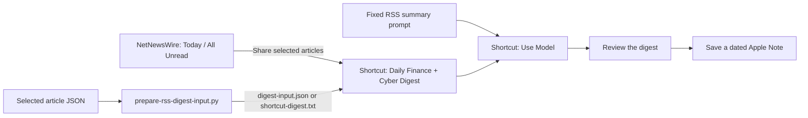

# NetNewsWire Finance + Cyber RSS

[](https://github.com/ZeroXSHDW/NetNewsWire_iOS_RSS/actions/workflows/rss-validation.yml)

A manifest-driven, privacy-conscious RSS workflow for **NetNewsWire on iPhone**. It combines Ireland, EU, UK and US finance sources with official cybersecurity alerts, incident reporting and technical research—and adds an optional Apple Intelligence digest layer for articles you deliberately provide.

> **The short version:** NetNewsWire collects and organizes the feeds. The manifest defines what belongs in each profile. Apple Intelligence summarizes only the selected, prepared article text; it does not fetch news, trade, or make decisions for you.

## At a glance

| Profile | Feeds | Best for | Download |
| --- | ---: | --- | --- |
| **iPhone Air** | 50 | Recommended daily profile with broad coverage and a 4 MB full-body budget | [OPML](AirDrop/NetNewsWire-Finance-Cyber-iPhone-Air.opml) · [source table](NetNewsWire-Finance-Cyber-iPhone-Air-Source-Table.md) |
| **iPhone Lite** | 39 | Lower-noise mobile reading and smaller refreshes | [OPML](NetNewsWire-Finance-Cyber-iPhone-Lite.opml) · [source table](NetNewsWire-Finance-Cyber-iPhone-Lite-Source-Table.md) |
| **Master** | 62 | Full research coverage and rebuilding the other profiles | [OPML](NetNewsWire-Finance-Cyber.opml) · [source table](NetNewsWire-Finance-Cyber-Source-Table.md) |

The repository contains **34 finance feeds** and **28 cybersecurity feeds**. Four official alert feeds are configured for interrupting notifications; the remaining sources are intended for normal reading, optional notifications or digest review.

## What this project does

- Keeps the feed inventory, folders, profile membership and notification policy in [`feed-manifest.json`](feed-manifest.json).
- Generates importable OPML files and human-readable source tables from that manifest.
- Provides iPhone Air and iPhone Lite bundles so the phone gets useful signal without importing every research feed.
- Prepares selected RSS articles for a repeatable Apple Intelligence workflow with deduplication, sanitization, time handling and size limits.
- Validates feed URLs, metadata, profile budgets and generated artifacts in CI.

The generated files are delivery artifacts. Edit the manifest first, then run `make generate` or `make package` to rebuild them.

## Feed coverage

### Finance — 34 feeds

| Group | Count | Coverage |
| --- | ---: | --- |
| Market & Trading | 8 | Trade halts, trader alerts, business headlines and market reporting |
| Official & Macro | 13 | Central banks, regulators, monetary policy, enforcement and market operations |
| Data, Ireland, EU & UK | 7 | Reference rates, statistical releases, sanctions guidance and release calendars |
| Global Data & Research | 3 | BIS and Bank of England research and releases |
| UK Regulation & Warnings | 3 | FCA news, scam warnings and OFSI sanctions updates |

### Cyber Security — 28 feeds

| Group | Count | Coverage |
| --- | ---: | --- |
| Ireland, EU & official alerts | 6 | Ireland NCSC, CISA, CERT-EU, CERT-FR and NCSC UK alerts |
| News & incident reporting | 6 | BleepingComputer, Dark Reading, Krebs, CyberScoop, SecurityWeek and The Record |
| Technical research | 7 | SANS ISC, CERT/CC, NIST, Mandiant, Microsoft, Unit 42 and GitHub Security |
| Specialist alerts & research | 9 | ICS, cloud, PSIRT, supply-chain, threat-intelligence and vendor research |

<details>
<summary>Show all 62 feed names</summary>

#### Finance

**Market & Trading**

- Nasdaq Trader — Trade Halts
- Nasdaq Trader — Equity Trader Alerts
- BBC — Business
- Bloomberg — Markets
- Financial Times — Markets
- MarketWatch — Top Stories
- RTÉ — Business
- The Wall Street Journal — Markets

**Official & Macro**

- Central Bank of Ireland — News
- European Central Bank — Press
- European Banking Authority — News
- European Systemic Risk Board — Press
- AMLA — News & Press
- Bank of England — News
- HM Treasury — News & Communications
- Federal Reserve — Monetary Policy
- SEC — Press Releases
- CFTC — General Press Releases
- CFTC — Enforcement
- ECB — Market Operations
- Federal Reserve — Speeches

**Data, Ireland, EU & UK**

- ECB — USD Reference Rate
- ECB — GBP Reference Rate
- ECB — Statistical Releases
- Central Bank of Ireland — Markets Update
- Eurostat — Economy & Finance Releases
- European Commission — Sanctions Guidance
- UK ONS — Release Calendar

**Global Data & Research**

- BIS — Statistical Releases
- BIS — Press Releases
- Bank of England — Publications

**UK Regulation & Warnings**

- FCA — News
- FCA — Scam Warnings
- OFSI — Financial Sanctions Blog

#### Cyber Security

**Ireland, EU & Official Alerts**

- Ireland NCSC — Alerts & Advisories
- CISA — All Advisories
- CERT-EU — Security Advisories
- CERT-FR — Security Alerts (French)
- NCSC UK — News
- NCSC UK — All Updates

**News & Incident Reporting**

- BleepingComputer
- Dark Reading
- Krebs on Security
- CyberScoop
- SecurityWeek
- The Record — Cybersecurity News

**Technical Research**

- SANS Internet Storm Center
- CERT/CC — Vulnerability Notes
- NIST — Cybersecurity Insights
- Google Threat Intelligence — Mandiant
- Microsoft Security Blog
- Unit 42 — Threat Research
- GitHub Security Blog

**Specialist Alerts & Research**

- CISA — ICS Advisories
- AWS Security Bulletins
- CERT-EU — Threat Intelligence
- CERT-FR — Security Advisories (French)
- Cisco PSIRT — Security Advisories
- Schneier on Security
- Cisco Talos
- CrowdStrike — Cybersecurity Research
- OpenSSF — Supply Chain Security

</details>

The complete URL, folder, notification and profile metadata for every feed is in the generated [Master source table](NetNewsWire-Finance-Cyber-Source-Table.md). The [notification profile](NetNewsWire-Notification-Profile.md) explains why a feed is interrupting, optional or quiet.

## Profiles and notification policy

- **iPhone Air** is the default: broad enough for daily finance and cyber awareness, while keeping full article bodies under a 4 MB profile budget.
- **iPhone Lite** is the smaller, lower-noise option for constrained mobile use.
- **Master** includes every feed and is useful for research, maintenance and rebuilding the derived profiles.

The four interrupting alert feeds are:

1. Ireland NCSC — Alerts & Advisories
2. CISA — All Advisories
3. CERT-EU — Security Advisories
4. Nasdaq Trader — Trade Halts

Other official sources can be enabled as optional notifications. News, research and duplicate-prone sources are intentionally quieter so the feed reader remains usable.

## Install in NetNewsWire

1. Run `make package` on the Mac, or use the committed **iPhone Air** handoff in [`AirDrop/`](AirDrop/).
2. AirDrop the **iPhone Air** OPML file to the iPhone. Use the root-level Lite or Master OPML if you want a different bundle.
3. Open the file in NetNewsWire and import it.
4. Refresh once, then review the notification settings against [`NetNewsWire-Notification-Profile.md`](NetNewsWire-Notification-Profile.md).
5. Use the Master OPML only when you want the full research set.

NetNewsWire remains the reading and collection layer. The bundle does not claim to provide live quotes, order books, positions, execution, incident-response commands or financial advice.

## How Apple Intelligence is used

Apple Intelligence is an **optional summarization step after collection**. It receives the article material that you selected in NetNewsWire—or the prepared JSON/text export created by this repository—and applies the fixed instructions in [`Apple-Intelligence-RSS-Summary-Prompt.md`](Apple-Intelligence-RSS-Summary-Prompt.md).



The workflow is deliberately bounded:

- **Input is explicit.** NetNewsWire does not silently hand over its entire unread database. Select Today, All Unread or individual articles and share them, or prepare a known JSON input file.
- **The preparation script is deterministic.** [`prepare-rss-digest-input.py`](prepare-rss-digest-input.py) canonicalizes fields, removes duplicate items, sanitizes article text, applies the chosen profile and enforces item/body/total-size budgets.
- **The model uses supplied evidence only.** The prompt tells Apple Intelligence not to browse, fill gaps, invent CVEs, prices, tickers, actors or impacts, or turn a headline into a confirmed event.
- **The output is a review aid.** The Shortcut shows the digest and can save `Finance + Cyber Digest — YYYY-MM-DD` to Apple Notes. It does not automatically mark articles read or recommend trades.
- **Model routing is intentional.** Use the on-device model for short/private batches, Private Cloud Compute for larger supported batches, or a ChatGPT extension only when deliberately selected in Shortcuts.

For the full Shortcut contract, scheduling limits and privacy/safety notes, see [`NetNewsWire-Daily-Digest-Workflow.md`](NetNewsWire-Daily-Digest-Workflow.md) and [`NetNewsWire-Feature-and-Automation-Matrix.md`](NetNewsWire-Feature-and-Automation-Matrix.md).

## Prepare a digest input

For a prepared article export, use the same profile you imported on the phone:

```bash
python3 prepare-rss-digest-input.py \
  --input selected-articles.json \
  --output digest-input.json \
  --shortcut-output shortcut-digest.txt \
  --profile iphone-air \
  --state .digest-state.json
```

The generated `shortcut-digest.txt` is convenient for a Shortcut text action. The JSON output is useful when you want to preserve structured fields such as publisher, publication time, link, summary and source metadata. The fixed prompt expects Dublin time for the daily view and clearly separates confirmed reporting from claims, speculation and missing context.

## Validate before sharing or publishing

```bash
make check          # offline generation, lint, tests and syntax checks
make validate       # live feed reachability and full-profile validation
make validate-lite  # live iPhone Lite validation
make validate-air   # live iPhone Air validation
```

Validation checks include:

- feed URLs, titles, folders, notification metadata and duplicate identities;
- generated OPML and source-table consistency;
- profile membership and full-body download budgets;
- redirect handling, XML validity, cache reuse and regression history;
- Python compilation, shell syntax and the repository test suite.

Committed validation snapshots are the root-level `*-VALIDATION-REPORT.md` and `*-VALIDATION-REPORT.json` files; the feed cache is kept outside the repository by default. See [`CONTRIBUTING.md`](CONTRIBUTING.md) for the maintainer workflow.

## Repository map

| Path | Purpose |
| --- | --- |
| [`feed-manifest.json`](feed-manifest.json) | Source of truth for feeds and profile policy |
| [`generate-bundle.py`](generate-bundle.py) | Generates OPML, source tables and notification metadata |
| [`validate-manifest.py`](validate-manifest.py) | Lints the manifest and generated artifacts |
| [`prepare-rss-digest-input.py`](prepare-rss-digest-input.py) | Prepares bounded article input for the Shortcut |
| [`AirDrop/`](AirDrop/) | Ready-to-send iPhone Air OPML and handoff notes |
| [Validation reports](NetNewsWire-Finance-Cyber-VALIDATION-REPORT.md) | Committed profile evidence and live-feed snapshots |
| [`.github/workflows/rss-validation.yml`](.github/workflows/rss-validation.yml) | Deterministic CI and scheduled live validation |

## Publishing and maintenance

The repository is public at [github.com/ZeroXSHDW/NetNewsWire_iOS_RSS](https://github.com/ZeroXSHDW/NetNewsWire_iOS_RSS). The publishing checklist is in [`GITHUB-PUBLISHING.md`](GITHUB-PUBLISHING.md); contribution and feed-change rules are in [`CONTRIBUTING.md`](CONTRIBUTING.md).

When changing a feed, edit [`feed-manifest.json`](feed-manifest.json), regenerate the bundle, run the checks, inspect the generated diff and commit the source plus derived artifacts together.
