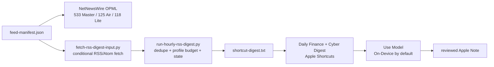

# Hourly NetNewsWire and Apple Intelligence workflow

This is the unattended path for a high-coverage update every 30 minutes (or a
slower interval you choose). It uses the same manifest that generates the
NetNewsWire OPML, then prepares a small, deduplicated text package for an Apple
Shortcuts **Use Model** action.

The boundary is important: NetNewsWire on iPhone does not expose a documented
bulk-unread export action. The unattended collector therefore mirrors the
manifest feed URLs; it does not claim to read or alter NetNewsWire’s private
unread database. For a strictly reader-selected digest, use NetNewsWire’s
Share Sheet and the manual workflow in [NetNewsWire-Daily-Digest-Workflow.md](NetNewsWire-Daily-Digest-Workflow.md).

## Data flow



The Master source profile is used by default so all 533 retained feeds are
eligible for collection. The Master digest budget limits the handoff to 36
items and 110,000 text characters. Use `--source-profile iphone-air
--digest-profile iphone-air` when the phone’s smaller 125-feed profile should
also control collection.

## One-time setup

1. Import exactly one OPML profile into NetNewsWire. Use Master for maximum
   coverage, Air for the recommended mobile profile, or Lite when refresh cost
   matters most. The generated files are in `artifacts/opml/`.
2. In Shortcuts, create a shortcut named **Daily Finance + Cyber Digest**. Its
   first live input must be **Shortcut Input**: use **Get Text from Input** (or
   the equivalent file-to-text conversion) and combine that result with the
   fixed instructions from
   [Apple-Intelligence-RSS-Summary-Prompt.md](Apple-Intelligence-RSS-Summary-Prompt.md),
   run **Use Model**, show the result, and optionally save it to a dated Apple
   Note. Keep **On-Device** selected for the normal short/private batch.
   A shortcut that only contains a static Text action can exit successfully
   while dropping the RSS package; the smoke test below must produce an output
   containing at least one source link whenever the package contains articles.
3. Test the handoff before scheduling it:

   ```sh
   make hourly-digest
   shortcuts run "Daily Finance + Cyber Digest" \
     --input-path ".runtime/hourly/shortcut-digest.txt" \
     --output-path ".runtime/hourly/apple-intelligence-output.txt"
   ```

   If the shortcut is not ready yet, `make hourly-digest` still prepares the
   files; the `shortcuts run` command will correctly report that the shortcut
   does not exist.
4. Install the macOS launch agent only after the shortcut test succeeds:

   ```sh
   ./automation/install-hourly-digest-launch-agent.sh
   ```

   The default interval is 1,800 seconds. To use one hour instead:

   ```sh
    NETNEWSWIRE_DIGEST_INTERVAL=3600 \
      ./automation/install-hourly-digest-launch-agent.sh
    ```

The launcher keeps each Apple Intelligence request below a conservative
4,000-byte input boundary. If a busy catch-up cycle produces more material,
it sends several bounded batches through the same Shortcut and combines the
successful outputs. The RSS collector still considers every feed in the
selected source profile; this boundary only controls the model handoff. Set
NETNEWSWIRE_SHORTCUT_MAX_INPUT_BYTES when a local model configuration has a
different tested limit.

The installer stages the launchd copy under
`~/Library/Application Support/NetNewsWireSubscriptions/` so macOS Desktop
privacy controls do not block unattended execution. `launchd` is best-effort:
the Mac must be awake, logged in and connected for the collector and Shortcut
to run. A sleep or network outage leaves the last good package in place and the
next successful run catches up using the local seen-item state.

## Output and health checks

The default runtime files are ignored by Git under `.runtime/hourly/`:

- `hourly-digest-input.json` — structured package, including collection health.
- `shortcut-digest.txt` — text input for Apple Shortcuts.
- `apple-intelligence-output.txt` — captured Shortcut output for the latest run.
- `fetch-state.json` — ETag/Last-Modified and last-result state per feed.
- `digest-state.json` — bounded item deduplication state.
- `launchd-stdout.log` and `launchd-stderr.log` — scheduler diagnostics.

The installed launchd copy uses the same filenames under
`~/Library/Application Support/NetNewsWireSubscriptions/hourly-runtime/`.

Run a manual cycle at any time with `make hourly-digest`. Each run uses the
previous successful collection time as its publication cursor, with a small
overlap to catch delayed items; the first run looks back 24 hours. This avoids
draining an old RSS archive into one hourly digest while still catching up
after a short outage. A partial collection is marked in the package and text
handoff. If every selected feed fails, the collector exits without replacing
the last successful output, so Apple Intelligence is not fed an empty or
falsely complete update.

The collector passes RSS summaries and links only; it does not scrape paywalled
articles, fetch live quotes, execute trades or issue incident-response commands.
The fixed prompt requires source links, separates confirmed facts from claims
and speculation, and ends with `No action recommendation`.

## iPhone-only limitation

Apple’s Shortcuts **Time of Day** automation is a daily trigger, not an hourly
recurrence. The 30-minute/hourly path therefore runs on macOS through `launchd`
and the macOS `shortcuts` command. If the digest must run only on iPhone, use
NetNewsWire’s Share Sheet for selected articles or create the required
time-of-day automations manually; a timer alone cannot extract NetNewsWire’s
unread items.
