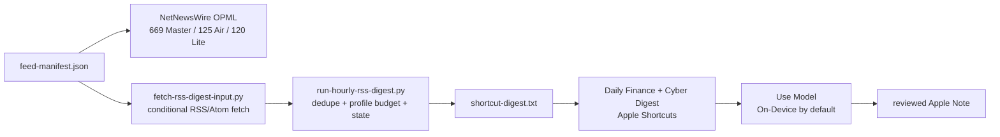

# Hourly NetNewsWire and Apple Intelligence workflow

This is the unattended path for a high-coverage update every 30 minutes (or a
slower interval you choose). It uses the same manifest that generates the
NetNewsWire OPML, then prepares a small, deduplicated text package for an Apple
Shortcuts **Use Model** action.

The boundary is important: NetNewsWire on iPhone does not expose a documented
bulk-unread export action. The unattended collector therefore mirrors the
manifest feed URLs; it does not claim to read or alter NetNewsWire’s private
unread database. For a strictly reader-selected digest, use NetNewsWire’s
Share Sheet and the manual workflow in [NetNewsWire-Daily-Digest-Workflow.md](NetNewsWire-Daily-Digest-Workflow.md).

## Data flow


```mermaid
flowchart LR
    MANIFEST["feed-manifest.json"] --> OPML["NetNewsWire OPML\n669 Master / 125 Air / 120 Lite"]
    MANIFEST --> FETCH["fetch-rss-digest-input.py\nconditional RSS/Atom fetch"]
    FETCH --> PREP["run-hourly-rss-digest.py\ndedupe + profile budget + state"]
    PREP --> INPUT["shortcut-digest.txt"]
    INPUT --> SHORTCUT["Daily Finance + Cyber Digest\nApple Shortcuts"]
    SHORTCUT --> MODEL["Use Model\nOn-Device by default"]
    MODEL --> NOTE["reviewed Apple Note"]
```

The Master source profile is used by default so all 669 retained feeds are
eligible for collection. The Master digest budget limits the handoff to 36
items and 110,000 text characters. Use `--source-profile iphone-air
--digest-profile iphone-air` when the phone’s smaller 125-feed profile should
also control collection.

The current Master collection also includes the compact, notification-off
Boursa Kuwait Market Message, Vietnam Official Gazette New Issues, Qatar News
Agency Economy Local and Chile Servicio de Impuestos Internos News RSS
streams. Together they add first-party Kuwait exchange and issuer-disclosure,
Vietnam legal and economic-policy, Qatar market/banking/investment/trade and
Chilean tax-administration and cross-border-tax context without changing the
125-Air or 120-Lite device budgets.

IAASA — News and Pensions Authority — News are also notification-off,
Master-only Irish inputs. Their first-party windows add audit/accounting
supervision, financial reporting, IORP, DORA, pension-data and governance
context without changing the 125-Air or 120-Lite device budgets.

Reserve Bank of New Zealand — News Releases is also a notification-off,
Master-only input. Its first-party window adds New Zealand monetary-policy,
financial-stability, prudential-regulation, payments, cash, banking and
macroeconomic context alongside the existing Treasury feeds without changing
the 125-Air or 120-Lite device budgets.

The current Air live-budget rebalance moved Bloomberg — Markets and ACN /
CSIRT Italia — Security Updates (Italian) to Master-only while retaining both
for the local Apple Intelligence collector. Air now contains 125 feeds; the
latest audit measured 4,165,376 full-response body bytes and 2,052,666 wire
bytes, leaving 28,928 bytes under the 4 MiB body ceiling. Lite remains at 120
feeds.

The three European Investment Bank streams—Projects to be Financed, Project
Procurement and Board and Institutional Events—are also notification-off,
Master-only inputs. Their first-party windows add prospective project-finance,
tender/implementation and institutional-calendar context without changing the
125-Air or 120-Lite device budgets.

APEC — Press, COMCEC — News and UNDP — Asia-Pacific News Centre are also
notification-off, Master-only inputs. Their direct first-party streams add
Asia-Pacific trade, investment, digital economy, food security, resilience,
finance, inclusive development, carbon markets, climate policy, AI governance,
tourism, transport and development context without changing the 125-Air or
120-Lite device budgets. European Data Protection Board — Publications is a
compact notification-off stream included in both phone profiles.

The three Bank of Canada research streams—Sparks at Bank Articles, Staff
Analytical Papers and Staff Working Papers—are included in this Master-only
collection and remain quiet inputs for the local Apple Intelligence digest.

Eurofound — News remains in the Master collection as a quiet EU labour-market
and social-policy input; it was moved out of Air/Lite after a live payload
rebalance to keep the phone profiles below their full-body budgets.

The recovered South African Reserve Bank News & Publications stream and the
four current English Central Bank of the Republic of Türkiye streams—
Publications, Data, Remarks by Governor and Press Releases—are also
notification-off and Master-only. They add first-party South African and
Turkish monetary, statistical, regulatory and policy signal without changing
the 125-Air or 120-Lite device budgets.

The four new Asian Development Bank streams—Blogs, Research Publications,
Evaluation and Features—and the CNA Business and Asia streams are also
notification-off and Master-only. They add distinct Asia-Pacific development,
business, trade, supply-chain and economic-security context without changing
the 125-Air or 120-Lite device budgets.

The three New Zealand Beehive portfolio streams—Finance, Economic Growth, and
Science, Innovation and Technology—are currently deferred because the
publisher returned an Incapsula HTML challenge instead of RSS/XML. They remain
documented recheck targets rather than active collection inputs.

The South African Revenue Service Latest News and Department of Science,
Technology and Innovation RSS streams are also notification-off and
Master-only. They add first-party South African tax, customs, compliance,
research, AI and innovation-policy context without changing the 125-Air or
120-Lite device budgets.

The three Nepal Rastra Bank streams—Media Releases, Circulars and Monetary
Policy—are also notification-off and Master-only. They add first-party Nepal
central-bank, banking-regulation, payment-system and monetary-policy context
without changing the 125-Air or 120-Lite device budgets.

The three new African central-bank streams—Bank of Ghana News, Central Bank
of Kenya News & Releases and Central Bank of Eswatini News & Releases—are also
notification-off and Master-only. They add first-party Ghanaian, Kenyan and
Eswatini monetary-policy, banking, market, statistical and financial-stability
context without changing the 125-Air or 120-Lite device budgets.

The four latest additions—Kenya Capital Markets Authority News & Releases,
Ghana Securities & Exchange Commission Public Notices, Central Bank of Lesotho
Monetary Policy Statements and ThaiCERT English News & Advisories—are also
notification-off and Master-only. They add first-party Kenyan securities,
Ghanaian public-notice, Lesotho monetary-policy and Thai cyber-advisory signal
without changing the 125-Air or 120-Lite device budgets. The compact Bank of
Russia English Press Releases stream is included in both phone profiles in the
slot freed by the deferred CIS route. The CIS RSS routes remain deferred
because the official endpoints currently return an HTML Object moved shell
rather than RSS/XML.

The four current Brazilian CVM feeds—Board Decisions, Legislation, Public
Consultations and Collegiate Bulletins—are included in the Master collection.
The compact Legislation and Collegiate Bulletins streams are also included in
Air/Lite; Board Decisions and Public Consultations remain Master-only. All four
are notification-off inputs for the local Apple Intelligence digest.

The three current Singapore Food Agency feeds—Food Alerts & Recalls, Newsroom
and Trade Circulars—are included in the Master collection. The compact Food
Alerts & Recalls stream is also included in Air/Lite; Newsroom and Trade
Circulars remain Master-only because Newsroom cross-posts recall items and
Trade Circulars has a larger archive body. All three are notification-off
inputs. OSFI News is included in Air/Lite; CISA News remains in Master after
the phone payload rebalance.

## One-time setup

1. Import exactly one OPML profile into NetNewsWire. Use Master for maximum
   coverage, Air for the recommended mobile profile, or Lite when refresh cost
   matters most. The generated files are in `artifacts/opml/`.
2. In Shortcuts, create a shortcut named **Daily Finance + Cyber Digest**. Its
   first live input must be **Shortcut Input**: use **Get Text from Input** (or
   the equivalent file-to-text conversion) and combine that result with the
   fixed instructions from
   [Apple-Intelligence-RSS-Summary-Prompt.md](Apple-Intelligence-RSS-Summary-Prompt.md),
   run **Use Model**, show the result, and optionally save it to a dated Apple
   Note. Keep **On-Device** selected for the normal short/private batch.
   A shortcut that only contains a static Text action can exit successfully
   while dropping the RSS package; the smoke test below must produce an output
   containing at least one source link whenever the package contains articles.
3. Test the handoff before scheduling it:

   ```sh
   make hourly-digest
   shortcuts run "Daily Finance + Cyber Digest" \
     --input-path ".runtime/hourly/shortcut-digest.txt" \
     --output-path ".runtime/hourly/apple-intelligence-output.txt"
   ```

   If the shortcut is not ready yet, `make hourly-digest` still prepares the
   files; the `shortcuts run` command will correctly report that the shortcut
   does not exist.
4. Install the macOS launch agent only after the shortcut test succeeds:

   ```sh
   ./automation/install-hourly-digest-launch-agent.sh
   ```

   The default interval is 1,800 seconds. To use one hour instead:

   ```sh
    NETNEWSWIRE_DIGEST_INTERVAL=3600 \
      ./automation/install-hourly-digest-launch-agent.sh
    ```

The launcher keeps each Apple Intelligence request below a conservative
4,000-byte input boundary. If a busy catch-up cycle produces more material,
it sends several bounded batches through the same Shortcut and combines the
successful outputs. The RSS collector still considers every feed in the
selected source profile; this boundary only controls the model handoff. Set
NETNEWSWIRE_SHORTCUT_MAX_INPUT_BYTES when a local model configuration has a
different tested limit.

The installer stages the launchd copy under
`~/Library/Application Support/NetNewsWireSubscriptions/` so macOS Desktop
privacy controls do not block unattended execution. `launchd` is best-effort:
the Mac must be awake, logged in and connected for the collector and Shortcut
to run. A sleep or network outage leaves the last good package in place and the
next successful run catches up using the local seen-item state.

## Output and health checks

The default runtime files are ignored by Git under `.runtime/hourly/`:

- `hourly-digest-input.json` — structured package, including collection health.
- `shortcut-digest.txt` — text input for Apple Shortcuts.
- `apple-intelligence-output.txt` — captured Shortcut output for the latest run.
- `fetch-state.json` — ETag/Last-Modified and last-result state per feed.
- `digest-state.json` — bounded item deduplication state.
- `health.json` — machine-readable run state and last successful run.
- `hourly.log`, `hourly.log.1` and `hourly.log.2` — bounded scheduler diagnostics.

The installed launchd copy uses the same filenames under
`~/Library/Application Support/NetNewsWireSubscriptions/hourly-runtime/`.

Run a manual cycle at any time with `make hourly-digest`. Each run uses the
previous successful collection time as its publication cursor, with a small
overlap to catch delayed items; the first run looks back 24 hours. This avoids
draining an old RSS archive into one hourly digest while still catching up
after a short outage. A partial collection is marked in the package and text
handoff. If every selected feed fails, the collector exits without replacing
the last successful output, so Apple Intelligence is not fed an empty or
falsely complete update.

The wrapper holds a process-wide run lock across fetching, digest preparation
and Shortcut execution. A second invocation exits without changing state, and
the launchd job has a hard timeout. If a run is interrupted after state was
updated but before the Shortcut completes, the wrapper restores the prior
fetch and digest state; inspect `health.json` before relying on the prepared
files. The collector uses a small recovery journal when committing fetch and
digest state together; if the process is killed between those commits, the
next run restores the previous pair and safely replays the batch. Unsupported
or corrupt state versions are rejected rather than silently reset.

The collector passes RSS summaries and links only; it does not scrape paywalled
articles, fetch live quotes, execute trades or issue incident-response commands.
The fixed prompt requires source links, separates confirmed facts from claims
and speculation, and ends with `No action recommendation`.

## iPhone-only limitation

Apple’s Shortcuts **Time of Day** automation is a daily trigger, not an hourly
recurrence. The 30-minute/hourly path therefore runs on macOS through `launchd`
and the macOS `shortcuts` command. If the digest must run only on iPhone, use
NetNewsWire’s Share Sheet for selected articles or create the required
time-of-day automations manually; a timer alone cannot extract NetNewsWire’s
unread items.
